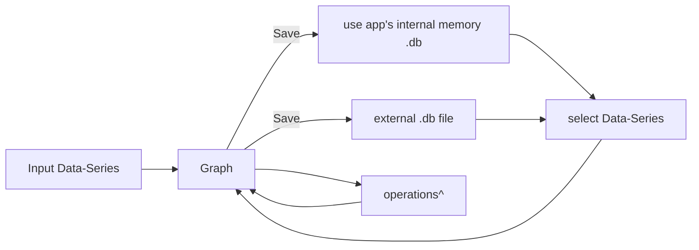

ultraplan I want to build a desktop app for visualising and interacting with time-series data. It needs to be super simple to use and intuitive. I really want this to feel like a standalone app that can be used by anyone.

## Here's the main gist
I want this app to have its own internal memory for each machine it's downloaded on. the logic is simple. You upload a data series, it's then shown in the Graph tab and you can play around with it a little bit / make simple calculations with the data series. if you chose to, you can then save that data series to memory, so that you can call it back to analyse it against other data series if you wish. 

You should also be able to create external data.db files with the app. so that you can share dataseries that you've manipulated/saved with others and they can use it. 

essentially it goes:


^ ex: turn from daily return to cumulative return. 
 


#### Sidebar with 2 main tabs
###### Sidebar design
should follow the sidebar design component.
###### Other Sidebar Details.
sidebar should contain the 2 tabs outlined below as well as a settings button which opens the settings tab. I sits at the bottom, just above the hide button, separated from the other two tabs. 


#### Graph Tab
Ultra smooth graphics needed, the graph is displayed uber cleanly in the center of the screen.
x-axis and y-axis are automatically set according to the date and number ranges. 

Base the functionality of this tab on the screenshots provided below, taken from the software available in the federal reserve bank of st louis' website

using the mouse scroll wheel zooms in and out. clicking and dragging over a certain period of time on the graph selects that time period and zooms it in to fill the whole graph.

'operations' button just above the top right corner of the graph opens a menu which slides in from the right border.

#### Adding a Line to Graph
'add line' button opens another right-side menu where you first select where you want to add the data series from:
1. Local (App) Memory
2. List of databases
The style should mimic the Dropdown 1 Component, but Local Memory should be separated from the other dbs as in the Separated Dropdown Component and preceded by the Local DB icon. dbs whose file paths cannot be resolved should be Disabled as it is in the Disabled Dropdown component.

Once the db is selected, a search table appears below the dropdown (animation like in Search table 2 / formatting like in search table 1). The table is also an accordion like in Search table 2 but when each line is clicked, the dropdown is an Area Chart component that ranges from the earlierst to the latest date in the time series and displays the time-series with and the times series' description below it. Each line in the search table shows Name (ex: US CPI), DB Code (ex: USCPI), date range (ex: jan 2000 - mar 2026).

###### Fred Screenshots:
link: [Consumer Price Index for All Urban Consumers: All Items in U.S. City Average | FRED | St. Louis Fed](https://fred.stlouisfed.org/graph/?g=1wmdD)

Main page:
![[Pasted image 20260414122718.png]]

Main Page with right-side operations (edit graph) menu open (refreshes live):
![[Pasted image 20260414122928.png]]

Side Menu tab 1:
![[Pasted image 20260414123006.png]]

Side menu tab 2:
![[Pasted image 20260414123100.png]]

Side Menu Tab 3:
![[Pasted image 20260414123156.png]]


#### Upload tab
###### 1st section:
drag and drop / browse zone for excel/csv files to be dropped in with
| Date | Series 1 | Series 2 | ... |
|---|
or copy-paste data series into an editable table which pastes everything cleanly.
^(choose between the two using the Selector Component)

when a csv/excel is dropped in or when a time-series is pasted in, a 'add to graph' button appears which, when clicked, takes us to the graph tab and displays the uploaded time-series.


#### Settings tab
###### DB Management
place where we can specify the file paths to the various external databases we might want to connect. this saves each file path we save as a shorter name which we can select in the 
###### Personalisation
Select / customise app colour theme (dark/light, colour palette selection, default graph data series line colours, etc.)


#### Components:
###### Selector
You are given a task to integrate an existing React component in the codebase

The codebase should support:
- shadcn project structure  
- Tailwind CSS
- Typescript

If it doesn't, provide instructions on how to setup project via shadcn CLI, install Tailwind or Typescript.

Determine the default path for components and styles. 
If default path for components is not /components/ui, provide instructions on why it's important to create this folder
Copy-paste this component to /components/ui folder:
```tsx
segment-group.tsx
"use client";

import { SegmentGroup } from "@ark-ui/react/segment-group";

export default function BasicSegmentGroup() {
  const frameworks = ["React", "Solid", "Svelte", "Vue"];

  return (
    <div className="max-w-sm w-full">
      <SegmentGroup.Root
        orientation="horizontal"
        className="flex gap-0.5 bg-gray-100 dark:bg-gray-900 relative p-1 rounded-lg"
      >
        <SegmentGroup.Indicator className="bg-white dark:bg-gray-800 z-10 rounded-md shadow-sm h-(--height) w-(--width) transition-all duration-200" />
        {frameworks.map((framework) => (
          <SegmentGroup.Item
            key={framework}
            value={framework}
            className="flex flex-1 items-center justify-center select-none cursor-pointer text-sm font-medium px-4 py-2 z-20 text-gray-600 dark:text-gray-400 hover:text-gray-900 dark:hover:text-white data-[state=checked]:text-gray-900 dark:data-[state=checked]:text-white data-disabled:cursor-not-allowed data-disabled:opacity-40 transition-colors duration-200"
          >
            <SegmentGroup.ItemText>{framework}</SegmentGroup.ItemText>
            <SegmentGroup.ItemControl />
            <SegmentGroup.ItemHiddenInput />
          </SegmentGroup.Item>
        ))}
      </SegmentGroup.Root>
    </div>
  );
}


demo.tsx
import BasicSegmentGroup from "@/components/ui/segment-group";

export default function DemoOne() {
  return <BasicSegmentGroup />;
}

```

Install NPM dependencies:
```bash
@ark-ui/react
```

Implementation Guidelines
 1. Analyze the component structure and identify all required dependencies
 2. Review the component's argumens and state
 3. Identify any required context providers or hooks and install them
 4. Questions to Ask
 - What data/props will be passed to this component?
 - Are there any specific state management requirements?
 - Are there any required assets (images, icons, etc.)?
 - What is the expected responsive behavior?
 - What is the best place to use this component in the app?

Steps to integrate
 0. Copy paste all the code above in the correct directories
 1. Install external dependencies
 2. Fill image assets with Unsplash stock images you know exist
 3. Use lucide-react icons for svgs or logos if component requires them

###### Sidebar design:
```
You are given a task to integrate an existing React component in the codebase

The codebase should support:
- shadcn project structure  
- Tailwind CSS
- Typescript

If it doesn't, provide instructions on how to setup project via shadcn CLI, install Tailwind or Typescript.

Determine the default path for components and styles. 
If default path for components is not /components/ui, provide instructions on why it's important to create this folder
Copy-paste this component to /components/ui folder:
```tsx
dashboard-with-collapsible-sidebar.tsx
"use client"
import React, { useState, useEffect } from "react";
import {
  Home,
  DollarSign,
  Monitor,
  ShoppingCart,
  Tag,
  BarChart3,
  Users,
  ChevronDown,
  ChevronsRight,
  Moon,
  Sun,
  TrendingUp,
  Activity,
  Package,
  Bell,
  Settings,
  HelpCircle,
  User,
} from "lucide-react";

export const Example = () => {
  const [isDark, setIsDark] = useState(false);

  useEffect(() => {
    if (isDark) {
      document.documentElement.classList.add('dark');
    } else {
      document.documentElement.classList.remove('dark');
    }
  }, [isDark]);

  return (
    <div className={`flex min-h-screen w-full ${isDark ? 'dark' : ''}`}>
      <div className="flex w-full bg-gray-50 dark:bg-gray-950 text-gray-900 dark:text-gray-100">
        <Sidebar />
        <ExampleContent isDark={isDark} setIsDark={setIsDark} />
      </div>
    </div>
  );
};

const Sidebar = () => {
  const [open, setOpen] = useState(true);
  const [selected, setSelected] = useState("Dashboard");

  return (
    <nav
      className={`sticky top-0 h-screen shrink-0 border-r transition-all duration-300 ease-in-out ${
        open ? 'w-64' : 'w-16'
      } border-gray-200 dark:border-gray-800 bg-white dark:bg-gray-900 p-2 shadow-sm`}
    >
      <TitleSection open={open} />

      <div className="space-y-1 mb-8">
        <Option
          Icon={Home}
          title="Dashboard"
          selected={selected}
          setSelected={setSelected}
          open={open}
        />
        <Option
          Icon={DollarSign}
          title="Sales"
          selected={selected}
          setSelected={setSelected}
          open={open}
          notifs={3}
        />
        <Option
          Icon={Monitor}
          title="View Site"
          selected={selected}
          setSelected={setSelected}
          open={open}
        />
        <Option
          Icon={ShoppingCart}
          title="Products"
          selected={selected}
          setSelected={setSelected}
          open={open}
        />
        <Option
          Icon={Tag}
          title="Tags"
          selected={selected}
          setSelected={setSelected}
          open={open}
        />
        <Option
          Icon={BarChart3}
          title="Analytics"
          selected={selected}
          setSelected={setSelected}
          open={open}
        />
        <Option
          Icon={Users}
          title="Members"
          selected={selected}
          setSelected={setSelected}
          open={open}
          notifs={12}
        />
      </div>

      {open && (
        <div className="border-t border-gray-200 dark:border-gray-800 pt-4 space-y-1">
          <div className="px-3 py-2 text-xs font-medium text-gray-500 dark:text-gray-400 uppercase tracking-wide">
            Account
          </div>
          <Option
            Icon={Settings}
            title="Settings"
            selected={selected}
            setSelected={setSelected}
            open={open}
          />
          <Option
            Icon={HelpCircle}
            title="Help & Support"
            selected={selected}
            setSelected={setSelected}
            open={open}
          />
        </div>
      )}

      <ToggleClose open={open} setOpen={setOpen} />
    </nav>
  );
};

const Option = ({ Icon, title, selected, setSelected, open, notifs }) => {
  const isSelected = selected === title;
  
  return (
    <button
      onClick={() => setSelected(title)}
      className={`relative flex h-11 w-full items-center rounded-md transition-all duration-200 ${
        isSelected 
          ? "bg-blue-50 dark:bg-blue-900/50 text-blue-700 dark:text-blue-300 shadow-sm border-l-2 border-blue-500" 
          : "text-gray-600 dark:text-gray-400 hover:bg-gray-50 dark:hover:bg-gray-800 hover:text-gray-900 dark:hover:text-gray-200"
      }`}
    >
      <div className="grid h-full w-12 place-content-center">
        <Icon className="h-4 w-4" />
      </div>
      
      {open && (
        <span
          className={`text-sm font-medium transition-opacity duration-200 ${
            open ? 'opacity-100' : 'opacity-0'
          }`}
        >
          {title}
        </span>
      )}

      {notifs && open && (
        <span className="absolute right-3 flex h-5 w-5 items-center justify-center rounded-full bg-blue-500 dark:bg-blue-600 text-xs text-white font-medium">
          {notifs}
        </span>
      )}
    </button>
  );
};

const TitleSection = ({ open }) => {
  return (
    <div className="mb-6 border-b border-gray-200 dark:border-gray-800 pb-4">
      <div className="flex cursor-pointer items-center justify-between rounded-md p-2 transition-colors hover:bg-gray-50 dark:hover:bg-gray-800">
        <div className="flex items-center gap-3">
          <Logo />
          {open && (
            <div className={`transition-opacity duration-200 ${open ? 'opacity-100' : 'opacity-0'}`}>
              <div className="flex items-center gap-2">
                <div>
                  <span className="block text-sm font-semibold text-gray-900 dark:text-gray-100">
                    TomIsLoading
                  </span>
                  <span className="block text-xs text-gray-500 dark:text-gray-400">
                    Pro Plan
                  </span>
                </div>
              </div>
            </div>
          )}
        </div>
        {open && (
          <ChevronDown className="h-4 w-4 text-gray-400 dark:text-gray-500" />
        )}
      </div>
    </div>
  );
};

const Logo = () => {
  return (
    <div className="grid size-10 shrink-0 place-content-center rounded-lg bg-gradient-to-br from-blue-500 to-blue-600 shadow-sm">
      <svg
        width="20"
        height="auto"
        viewBox="0 0 50 39"
        fill="none"
        xmlns="http://www.w3.org/2000/svg"
        className="fill-white"
      >
        <path
          d="M16.4992 2H37.5808L22.0816 24.9729H1L16.4992 2Z"
        />
        <path
          d="M17.4224 27.102L11.4192 36H33.5008L49 13.0271H32.7024L23.2064 27.102H17.4224Z"
        />
      </svg>
    </div>
  );
};

const ToggleClose = ({ open, setOpen }) => {
  return (
    <button
      onClick={() => setOpen(!open)}
      className="absolute bottom-0 left-0 right-0 border-t border-gray-200 dark:border-gray-800 transition-colors hover:bg-gray-50 dark:hover:bg-gray-800"
    >
      <div className="flex items-center p-3">
        <div className="grid size-10 place-content-center">
          <ChevronsRight
            className={`h-4 w-4 transition-transform duration-300 text-gray-500 dark:text-gray-400 ${
              open ? "rotate-180" : ""
            }`}
          />
        </div>
        {open && (
          <span
            className={`text-sm font-medium text-gray-600 dark:text-gray-300 transition-opacity duration-200 ${
              open ? 'opacity-100' : 'opacity-0'
            }`}
          >
            Hide
          </span>
        )}
      </div>
    </button>
  );
};

const ExampleContent = ({ isDark, setIsDark }) => {
  return (
    <div className="flex-1 bg-gray-50 dark:bg-gray-950 p-6 overflow-auto">
      {/* Header */}
      <div className="flex items-center justify-between mb-8">
        <div>
          <h1 className="text-3xl font-bold text-gray-900 dark:text-gray-100">Dashboard</h1>
          <p className="text-gray-600 dark:text-gray-400 mt-1">Welcome back to your dashboard</p>
        </div>
        <div className="flex items-center gap-4">
          <button className="relative p-2 rounded-lg bg-white dark:bg-gray-900 border border-gray-200 dark:border-gray-800 text-gray-600 dark:text-gray-400 hover:text-gray-900 dark:hover:text-gray-100 transition-colors">
            <Bell className="h-5 w-5" />
            <span className="absolute -top-1 -right-1 h-3 w-3 bg-red-500 rounded-full"></span>
          </button>
          <button
            onClick={() => setIsDark(!isDark)}
            className="flex h-10 w-10 items-center justify-center rounded-lg border border-gray-200 dark:border-gray-800 bg-white dark:bg-gray-900 text-gray-600 dark:text-gray-400 hover:bg-gray-50 dark:hover:bg-gray-800 hover:text-gray-900 dark:hover:text-gray-100 transition-colors"
          >
            {isDark ? (
              <Sun className="h-4 w-4" />
            ) : (
              <Moon className="h-4 w-4" />
            )}
          </button>
          <button className="p-2 rounded-lg bg-white dark:bg-gray-900 border border-gray-200 dark:border-gray-800 text-gray-600 dark:text-gray-400 hover:text-gray-900 dark:hover:text-gray-100 transition-colors">
            <User className="h-5 w-5" />
          </button>
        </div>
      </div>
      
      {/* Stats Grid */}
      <div className="grid grid-cols-1 md:grid-cols-2 lg:grid-cols-4 gap-6 mb-8">
        <div className="p-6 rounded-xl border border-gray-200 dark:border-gray-800 bg-white dark:bg-gray-900 shadow-sm hover:shadow-md transition-shadow">
          <div className="flex items-center justify-between mb-4">
            <div className="p-2 bg-blue-50 dark:bg-blue-900/20 rounded-lg">
              <DollarSign className="h-5 w-5 text-blue-600 dark:text-blue-400" />
            </div>
            <TrendingUp className="h-4 w-4 text-green-500" />
          </div>
          <h3 className="font-medium text-gray-600 dark:text-gray-400 mb-1">Total Sales</h3>
          <p className="text-2xl font-bold text-gray-900 dark:text-gray-100">$24,567</p>
          <p className="text-sm text-green-600 dark:text-green-400 mt-1">+12% from last month</p>
        </div>
        
        <div className="p-6 rounded-xl border border-gray-200 dark:border-gray-800 bg-white dark:bg-gray-900 shadow-sm hover:shadow-md transition-shadow">
          <div className="flex items-center justify-between mb-4">
            <div className="p-2 bg-green-50 dark:bg-green-900/20 rounded-lg">
              <Users className="h-5 w-5 text-green-600 dark:text-green-400" />
            </div>
            <TrendingUp className="h-4 w-4 text-green-500" />
          </div>
          <h3 className="font-medium text-gray-600 dark:text-gray-400 mb-1">Active Users</h3>
          <p className="text-2xl font-bold text-gray-900 dark:text-gray-100">1,234</p>
          <p className="text-sm text-green-600 dark:text-green-400 mt-1">+5% from last week</p>
        </div>
        
        <div className="p-6 rounded-xl border border-gray-200 dark:border-gray-800 bg-white dark:bg-gray-900 shadow-sm hover:shadow-md transition-shadow">
          <div className="flex items-center justify-between mb-4">
            <div className="p-2 bg-purple-50 dark:bg-purple-900/20 rounded-lg">
              <ShoppingCart className="h-5 w-5 text-purple-600 dark:text-purple-400" />
            </div>
            <TrendingUp className="h-4 w-4 text-green-500" />
          </div>
          <h3 className="font-medium text-gray-600 dark:text-gray-400 mb-1">Orders</h3>
          <p className="text-2xl font-bold text-gray-900 dark:text-gray-100">456</p>
          <p className="text-sm text-green-600 dark:text-green-400 mt-1">+8% from yesterday</p>
        </div>

        <div className="p-6 rounded-xl border border-gray-200 dark:border-gray-800 bg-white dark:bg-gray-900 shadow-sm hover:shadow-md transition-shadow">
          <div className="flex items-center justify-between mb-4">
            <div className="p-2 bg-orange-50 dark:bg-orange-900/20 rounded-lg">
              <Package className="h-5 w-5 text-orange-600 dark:text-orange-400" />
            </div>
            <TrendingUp className="h-4 w-4 text-green-500" />
          </div>
          <h3 className="font-medium text-gray-600 dark:text-gray-400 mb-1">Products</h3>
          <p className="text-2xl font-bold text-gray-900 dark:text-gray-100">89</p>
          <p className="text-sm text-green-600 dark:text-green-400 mt-1">+3 new this week</p>
        </div>
      </div>
      
      {/* Content Grid */}
      <div className="grid grid-cols-1 lg:grid-cols-3 gap-8">
        {/* Recent Activity */}
        <div className="lg:col-span-2">
          <div className="rounded-xl border border-gray-200 dark:border-gray-800 bg-white dark:bg-gray-900 p-6 shadow-sm">
            <div className="flex items-center justify-between mb-6">
              <h3 className="text-lg font-semibold text-gray-900 dark:text-gray-100">Recent Activity</h3>
              <button className="text-sm text-blue-600 dark:text-blue-400 hover:text-blue-700 dark:hover:text-blue-300 font-medium">
                View all
              </button>
            </div>
            <div className="space-y-4">
              {[
                { icon: DollarSign, title: "New sale recorded", desc: "Order #1234 completed", time: "2 min ago", color: "green" },
                { icon: Users, title: "New user registered", desc: "john.doe@example.com joined", time: "5 min ago", color: "blue" },
                { icon: Package, title: "Product updated", desc: "iPhone 15 Pro stock updated", time: "10 min ago", color: "purple" },
                { icon: Activity, title: "System maintenance", desc: "Scheduled backup completed", time: "1 hour ago", color: "orange" },
                { icon: Bell, title: "New notification", desc: "Marketing campaign results", time: "2 hours ago", color: "red" },
              ].map((activity, i) => (
                <div key={i} className="flex items-center space-x-4 p-3 rounded-lg hover:bg-gray-50 dark:hover:bg-gray-800 transition-colors cursor-pointer">
                  <div className={`p-2 rounded-lg ${
                    activity.color === 'green' ? 'bg-green-50 dark:bg-green-900/20' :
                    activity.color === 'blue' ? 'bg-blue-50 dark:bg-blue-900/20' :
                    activity.color === 'purple' ? 'bg-purple-50 dark:bg-purple-900/20' :
                    activity.color === 'orange' ? 'bg-orange-50 dark:bg-orange-900/20' :
                    'bg-red-50 dark:bg-red-900/20'
                  }`}>
                    <activity.icon className={`h-4 w-4 ${
                      activity.color === 'green' ? 'text-green-600 dark:text-green-400' :
                      activity.color === 'blue' ? 'text-blue-600 dark:text-blue-400' :
                      activity.color === 'purple' ? 'text-purple-600 dark:text-purple-400' :
                      activity.color === 'orange' ? 'text-orange-600 dark:text-orange-400' :
                      'text-red-600 dark:text-red-400'
                    }`} />
                  </div>
                  <div className="flex-1 min-w-0">
                    <p className="text-sm font-medium text-gray-900 dark:text-gray-100 truncate">
                      {activity.title}
                    </p>
                    <p className="text-xs text-gray-500 dark:text-gray-400 truncate">
                      {activity.desc}
                    </p>
                  </div>
                  <div className="text-xs text-gray-400 dark:text-gray-500">
                    {activity.time}
                  </div>
                </div>
              ))}
            </div>
          </div>
        </div>

        {/* Quick Stats */}
        <div className="space-y-6">
          <div className="rounded-xl border border-gray-200 dark:border-gray-800 bg-white dark:bg-gray-900 p-6 shadow-sm">
            <h3 className="text-lg font-semibold text-gray-900 dark:text-gray-100 mb-4">Quick Stats</h3>
            <div className="space-y-4">
              <div className="flex justify-between items-center">
                <span className="text-sm text-gray-600 dark:text-gray-400">Conversion Rate</span>
                <span className="text-sm font-medium text-gray-900 dark:text-gray-100">3.2%</span>
              </div>
              <div className="w-full bg-gray-200 dark:bg-gray-700 rounded-full h-2">
                <div className="bg-blue-500 h-2 rounded-full" style={{ width: '32%' }}></div>
              </div>
              
              <div className="flex justify-between items-center">
                <span className="text-sm text-gray-600 dark:text-gray-400">Bounce Rate</span>
                <span className="text-sm font-medium text-gray-900 dark:text-gray-100">45%</span>
              </div>
              <div className="w-full bg-gray-200 dark:bg-gray-700 rounded-full h-2">
                <div className="bg-orange-500 h-2 rounded-full" style={{ width: '45%' }}></div>
              </div>
              
              <div className="flex justify-between items-center">
                <span className="text-sm text-gray-600 dark:text-gray-400">Page Views</span>
                <span className="text-sm font-medium text-gray-900 dark:text-gray-100">8.7k</span>
              </div>
              <div className="w-full bg-gray-200 dark:bg-gray-700 rounded-full h-2">
                <div className="bg-green-500 h-2 rounded-full" style={{ width: '87%' }}></div>
              </div>
            </div>
          </div>

          <div className="rounded-xl border border-gray-200 dark:border-gray-800 bg-white dark:bg-gray-900 p-6 shadow-sm">
            <h3 className="text-lg font-semibold text-gray-900 dark:text-gray-100 mb-4">Top Products</h3>
            <div className="space-y-3">
              {['iPhone 15 Pro', 'MacBook Air M2', 'AirPods Pro', 'iPad Air'].map((product, i) => (
                <div key={i} className="flex items-center justify-between py-2">
                  <span className="text-sm text-gray-600 dark:text-gray-400">{product}</span>
                  <span className="text-sm font-medium text-gray-900 dark:text-gray-100">
                    ${Math.floor(Math.random() * 1000 + 500)}
                  </span>
                </div>
              ))}
            </div>
          </div>
        </div>
      </div>
    </div>
  );
};

export default Example;

demo.tsx
import { Example } from "@/components/ui/dashboard-with-collapsible-sidebar";

export default function DemoOne() {
  return <Example />;
}

```

Install NPM dependencies:
```bash
lucide-react
```

Implementation Guidelines
 1. Analyze the component structure and identify all required dependencies
 2. Review the component's argumens and state
 3. Identify any required context providers or hooks and install them
 4. Questions to Ask
 - What data/props will be passed to this component?
 - Are there any specific state management requirements?
 - Are there any required assets (images, icons, etc.)?
 - What is the expected responsive behavior?
 - What is the best place to use this component in the app?

Steps to integrate
 0. Copy paste all the code above in the correct directories
 1. Install external dependencies
 2. Fill image assets with Unsplash stock images you know exist
 3. Use lucide-react icons for svgs or logos if component requires them

###### Dropdown 1
You are given a task to integrate an existing React component in the codebase

The codebase should support:
- shadcn project structure  
- Tailwind CSS
- Typescript

If it doesn't, provide instructions on how to setup project via shadcn CLI, install Tailwind or Typescript.

Determine the default path for components and styles. 
If default path for components is not /components/ui, provide instructions on why it's important to create this folder
Copy-paste this component to /components/ui folder:
```tsx
animated-dropdown.tsx
'use client'

import React from 'react'

/**
 * @author: @emerald-ui
 * @description: Animated Dropdown Component with smooth transitions and click-outside behavior
 * @version: 1.0.0
 * @date: 2026-02-03
 * @license: MIT
 * @website: https://emerald-ui.com
 */
import { useState, useRef, FC, ReactNode } from 'react'
import { ChevronDown } from 'lucide-react'
import { AnimatePresence, motion } from 'framer-motion'
import { clsx } from 'clsx'
import { twMerge } from 'tailwind-merge'
function cn(...inputs: any[]) { return twMerge(clsx(inputs)) }

const Button = React.forwardRef<HTMLButtonElement, React.ButtonHTMLAttributes<HTMLButtonElement> & { variant?: string; size?: string }>(
  ({ className, variant, size, ...props }, ref) => (
    <button ref={ref} className={cn(
      "inline-flex items-center justify-center rounded-md text-sm font-medium transition-colors focus-visible:outline-none focus-visible:ring-2 focus-visible:ring-offset-2 disabled:pointer-events-none disabled:opacity-50",
      variant === "outline" ? "border border-input bg-background hover:bg-accent hover:text-accent-foreground" :
      variant === "ghost" ? "hover:bg-accent hover:text-accent-foreground" :
      variant === "link" ? "text-primary underline-offset-4 hover:underline" :
      "bg-primary text-primary-foreground hover:bg-primary/90",
      size === "sm" ? "h-9 px-3" : size === "lg" ? "h-11 px-8" : size === "icon" ? "h-10 w-10" : "h-10 px-4 py-2",
      className
    )} {...props} />
  )
);
Button.displayName = "Button";

function useClickOutside(ref: React.RefObject<HTMLElement | null>, handler: () => void) {
  React.useEffect(() => {
    const handleClickOutside = (event: MouseEvent) => {
      if (ref.current && !ref.current.contains(event.target as Node)) handler()
    }
    document.addEventListener('mousedown', handleClickOutside)
    return () => document.removeEventListener('mousedown', handleClickOutside)
  }, [ref, handler])
}


interface DropdownItem {
  name: string
  link: string
}

interface AnimatedDropdownProps {
  items?: DropdownItem[]
  text?: string
  className?: string
}

const DEMO: DropdownItem[] = [
  { name: 'Documentation', link: '#' },
  { name: 'Components', link: '#' },
  { name: 'Examples', link: '#' },
  { name: 'GitHub', link: '#' },
]

export default function AnimatedDropdown({
  items = DEMO,
  text = 'Select Option',
  className,
}: AnimatedDropdownProps) {
  const [isOpen, setIsOpen] = useState(false)

  return (
    <OnClickOutside onClickOutside={() => setIsOpen(false)}>
      <div
        data-state={isOpen ? 'open' : 'closed'}
        className={cn('group relative inline-block', className)}
      >
        <Button
          variant='outline'
          aria-haspopup='listbox'
          aria-expanded={isOpen}
          onClick={() => setIsOpen(!isOpen)}
        >
          <span>{text}</span>
          <motion.div
            animate={{ rotate: isOpen ? 180 : 0 }}
            transition={{ duration: 0.2, ease: 'easeInOut' }}
          >
            <ChevronDown className='h-5 w-5' />
          </motion.div>
        </Button>

        <AnimatePresence>
          {isOpen && (
            <motion.div
              role='listbox'
              initial={{ opacity: 0, y: -10, scale: 0.95 }}
              animate={{ opacity: 1, y: 0, scale: 1 }}
              exit={{ opacity: 0, y: -10, scale: 0.95 }}
              transition={{
                duration: 0.2,
                ease: 'easeOut',
              }}
              className={cn(
                'absolute top-[calc(100%+0.5rem)] left-1/2 z-50 w-fit min-w-full -translate-x-1/2',
                'overflow-hidden rounded-md',
                'bg-slate-100 dark:bg-zinc-900',
                'border-2 border-slate-200 dark:border-zinc-800',
                'shadow-lg'
              )}
            >
              <motion.div
                initial='hidden'
                animate='visible'
                variants={{
                  visible: {
                    transition: {
                      staggerChildren: 0.03,
                    },
                  },
                }}
              >
                {items.map((item, index) => (
                  <motion.a
                    key={index}
                    href={item.link}
                    variants={{
                      hidden: { opacity: 0, x: -20 },
                      visible: { opacity: 1, x: 0 },
                    }}
                    className={cn(
                      'inline-block w-full px-3 py-2 text-sm',
                      'border-b-2 border-slate-200 last:border-b-0 dark:border-zinc-800',
                      'bg-slate-50 hover:bg-slate-200 dark:bg-zinc-900 dark:hover:bg-zinc-800',
                      'transition-colors duration-150',
                      'text-foreground no-underline'
                    )}
                  >
                    {item.name}
                  </motion.a>
                ))}
              </motion.div>
            </motion.div>
          )}
        </AnimatePresence>
      </div>
    </OnClickOutside>
  )
}

interface Props {
  children: ReactNode
  onClickOutside: () => void
  classes?: string
}

const OnClickOutside: FC<Props> = ({ children, onClickOutside, classes }) => {
  const wrapperRef = useRef<HTMLDivElement>(null)

  useClickOutside(wrapperRef, onClickOutside)

  return (
    <div ref={wrapperRef} className={cn(classes)}>
      {children}
    </div>
  )
}


demo.tsx
import AnimatedDropdown from "../components/ui/animated-dropdown";
export default function Demo() {
  return (
    <div className="flex items-center justify-center min-h-screen bg-background">
      <AnimatedDropdown />
    </div>
  );
}
```

Install NPM dependencies:
```bash
clsx, lucide-react, framer-motion, tailwind-merge
```

Implementation Guidelines
 1. Analyze the component structure and identify all required dependencies
 2. Review the component's argumens and state
 3. Identify any required context providers or hooks and install them
 4. Questions to Ask
 - What data/props will be passed to this component?
 - Are there any specific state management requirements?
 - Are there any required assets (images, icons, etc.)?
 - What is the expected responsive behavior?
 - What is the best place to use this component in the app?

Steps to integrate
 0. Copy paste all the code above in the correct directories
 1. Install external dependencies
 2. Fill image assets with Unsplash stock images you know exist
 3. Use lucide-react icons for svgs or logos if component requires them

###### Separated Dropdown
You are given a task to integrate an existing React component in the codebase

The codebase should support:
- shadcn project structure  
- Tailwind CSS
- Typescript

If it doesn't, provide instructions on how to setup project via shadcn CLI, install Tailwind or Typescript.

Determine the default path for components and styles. 
If default path for components is not /components/ui, provide instructions on why it's important to create this folder
Copy-paste this component to /components/ui folder:
```tsx
dropdown.tsx
import React from 'react';
import { DownOutlined, SmileOutlined } from '@ant-design/icons';
import type { MenuProps } from 'antd';
import { Dropdown, Space } from 'antd';

const items: MenuProps['items'] = [
  {
    key: '1',
    label: (
      <a target="_blank" rel="noopener noreferrer" href="https://www.antgroup.com">
        1st menu item
      </a>
    ),
  },
  {
    key: '2',
    label: (
      <a target="_blank" rel="noopener noreferrer" href="https://www.aliyun.com">
        2nd menu item (disabled)
      </a>
    ),
    icon: <SmileOutlined />,
    disabled: true,
  },
  {
    key: '3',
    label: (
      <a target="_blank" rel="noopener noreferrer" href="https://www.luohanacademy.com">
        3rd menu item (disabled)
      </a>
    ),
    disabled: true,
  },
  {
    key: '4',
    danger: true,
    label: 'a danger item',
  },
];

const App: React.FC = () => (
  <Dropdown menu={{ items }}>
    <a onClick={(e) => e.preventDefault()}>
      <Space>
        Hover me
        <DownOutlined />
      </Space>
    </a>
  </Dropdown>
);

export default App;

demo.tsx
import React from 'react';
import { DownOutlined } from '@ant-design/icons';
import type { MenuProps } from 'antd';
import { Dropdown, Space } from 'antd';

const items: MenuProps['items'] = [
  {
    label: (
      <a href="https://www.antgroup.com" target="_blank" rel="noopener noreferrer">
        1st menu item
      </a>
    ),
    key: '0',
  },
  {
    label: (
      <a href="https://www.aliyun.com" target="_blank" rel="noopener noreferrer">
        2nd menu item
      </a>
    ),
    key: '1',
  },
  {
    type: 'divider',
  },
  {
    label: '3rd menu item',
    key: '3',
  },
];

const App: React.FC = () => (
  <Dropdown menu={{ items }} trigger={['click']}>
    <a onClick={(e) => e.preventDefault()}>
      <Space>
        Click me
        <DownOutlined />
      </Space>
    </a>
  </Dropdown>
);

export default App;
```

Install NPM dependencies:
```bash
antd, @ant-design/icons
```

Implementation Guidelines
 1. Analyze the component structure and identify all required dependencies
 2. Review the component's argumens and state
 3. Identify any required context providers or hooks and install them
 4. Questions to Ask
 - What data/props will be passed to this component?
 - Are there any specific state management requirements?
 - Are there any required assets (images, icons, etc.)?
 - What is the expected responsive behavior?
 - What is the best place to use this component in the app?

Steps to integrate
 0. Copy paste all the code above in the correct directories
 1. Install external dependencies
 2. Fill image assets with Unsplash stock images you know exist
 3. Use lucide-react icons for svgs or logos if component requires them

###### Disabled Items Dropdown
You are given a task to integrate an existing React component in the codebase

The codebase should support:
- shadcn project structure  
- Tailwind CSS
- Typescript

If it doesn't, provide instructions on how to setup project via shadcn CLI, install Tailwind or Typescript.

Determine the default path for components and styles. 
If default path for components is not /components/ui, provide instructions on why it's important to create this folder
Copy-paste this component to /components/ui folder:
```tsx
dropdown.tsx
import React from 'react';
import { DownOutlined, SmileOutlined } from '@ant-design/icons';
import type { MenuProps } from 'antd';
import { Dropdown, Space } from 'antd';

const items: MenuProps['items'] = [
  {
    key: '1',
    label: (
      <a target="_blank" rel="noopener noreferrer" href="https://www.antgroup.com">
        1st menu item
      </a>
    ),
  },
  {
    key: '2',
    label: (
      <a target="_blank" rel="noopener noreferrer" href="https://www.aliyun.com">
        2nd menu item (disabled)
      </a>
    ),
    icon: <SmileOutlined />,
    disabled: true,
  },
  {
    key: '3',
    label: (
      <a target="_blank" rel="noopener noreferrer" href="https://www.luohanacademy.com">
        3rd menu item (disabled)
      </a>
    ),
    disabled: true,
  },
  {
    key: '4',
    danger: true,
    label: 'a danger item',
  },
];

const App: React.FC = () => (
  <Dropdown menu={{ items }}>
    <a onClick={(e) => e.preventDefault()}>
      <Space>
        Hover me
        <DownOutlined />
      </Space>
    </a>
  </Dropdown>
);

export default App;

demo.tsx
import React from 'react';
import { DownOutlined } from '@ant-design/icons';
import type { MenuProps } from 'antd';
import { Dropdown, Space } from 'antd';

const items: MenuProps['items'] = [
  {
    label: (
      <a target="_blank" rel="noopener noreferrer" href="https://www.antgroup.com">
        1st menu item
      </a>
    ),
    key: '0',
  },
  {
    label: (
      <a target="_blank" rel="noopener noreferrer" href="https://www.aliyun.com">
        2nd menu item
      </a>
    ),
    key: '1',
  },
  {
    type: 'divider',
  },
  {
    label: '3rd menu item（disabled）',
    key: '3',
    disabled: true,
  },
];

const App: React.FC = () => (
  <Dropdown menu={{ items }}>
    <a onClick={(e) => e.preventDefault()}>
      <Space>
        Hover me
        <DownOutlined />
      </Space>
    </a>
  </Dropdown>
);

export default App;
```

Install NPM dependencies:
```bash
antd, @ant-design/icons
```

Implementation Guidelines
 1. Analyze the component structure and identify all required dependencies
 2. Review the component's argumens and state
 3. Identify any required context providers or hooks and install them
 4. Questions to Ask
 - What data/props will be passed to this component?
 - Are there any specific state management requirements?
 - Are there any required assets (images, icons, etc.)?
 - What is the expected responsive behavior?
 - What is the best place to use this component in the app?

Steps to integrate
 0. Copy paste all the code above in the correct directories
 1. Install external dependencies
 2. Fill image assets with Unsplash stock images you know exist
 3. Use lucide-react icons for svgs or logos if component requires them

###### Search Table 1
You are given a task to integrate an existing React component in the codebase

The codebase should support:
- shadcn project structure  
- Tailwind CSS
- Typescript

If it doesn't, provide instructions on how to setup project via shadcn CLI, install Tailwind or Typescript.

Determine the default path for components and styles. 
If default path for components is not /components/ui, provide instructions on why it's important to create this folder
Copy-paste this component to /components/ui folder:
```tsx
spotlight-table.tsx
// components/ui/component.tsx
import { useState } from "react";

const data = [
  { id: 1, name: "Astra", role: "Engineer", status: "Active" },
  { id: 2, name: "Bravo", role: "Design", status: "Active" },
  { id: 3, name: "Charlie", role: "Marketing", status: "Offline" },
  { id: 4, name: "Delta", role: "Sales", status: "Active" },
];

export const Component = () => {
  const [q, setQ] = useState("");
  const lower = q.toLowerCase();
  return (
    <div className="h-screen grid place-content-center bg-background text-foreground p-8">
      <input
        value={q}
        onChange={(e) => setQ(e.target.value)}
        placeholder="Search name or role..."
        className="mb-4 px-4 py-2 rounded-lg border border-input bg-background max-w-sm"
      />
      <table className="min-w-[500px] border-collapse">
        <thead>
          <tr className="border-b border-border">
            <th className="p-3 text-left">Name</th>
            <th className="p-3 text-left">Role</th>
            <th className="p-3 text-left">Status</th>
          </tr>
        </thead>
        <tbody>
          {data.map((row) => {
            const hit = lower && Object.values(row).some((v) => String(v).toLowerCase().includes(lower));
            return (
              <tr
                key={row.id}
                className={`transition ${hit ? "opacity-100" : q ? "opacity-20" : "opacity-100"}`}
              >
                <td className="p-3">{row.name}</td>
                <td className="p-3">{row.role}</td>
                <td className="p-3">
                  <span
                    className={`px-2 py-1 rounded text-xs ${
                      row.status === "Active" ? "bg-green-500/20 text-green-400" : "bg-gray-500/20 text-gray-400"
                    }`}
                  >
                    {row.status}
                  </span>
                </td>
              </tr>
            );
          })}
        </tbody>
      </table>
    </div>
  );
};

demo.tsx
import { Component } from "@/components/ui/spotlight-table";

export default function DemoOne() {
  return <Component />;
}

```

Implementation Guidelines
 1. Analyze the component structure and identify all required dependencies
 2. Review the component's argumens and state
 3. Identify any required context providers or hooks and install them
 4. Questions to Ask
 - What data/props will be passed to this component?
 - Are there any specific state management requirements?
 - Are there any required assets (images, icons, etc.)?
 - What is the expected responsive behavior?
 - What is the best place to use this component in the app?

Steps to integrate
 0. Copy paste all the code above in the correct directories
 1. Install external dependencies
 2. Fill image assets with Unsplash stock images you know exist
 3. Use lucide-react icons for svgs or logos if component requires them

###### Search Table 2
You are given a task to integrate an existing React component in the codebase

The codebase should support:
- shadcn project structure  
- Tailwind CSS
- Typescript

If it doesn't, provide instructions on how to setup project via shadcn CLI, install Tailwind or Typescript.

Determine the default path for components and styles. 
If default path for components is not /components/ui, provide instructions on why it's important to create this folder
Copy-paste this component to /components/ui folder:
```tsx
interactive-logs-table-shadcnui.tsx
import { AnimatePresence, motion } from "framer-motion";
import { Check, ChevronDown, Filter, Search } from "lucide-react";
import { useMemo, useState } from "react";

import { Badge } from "@/components/ui/badge";
import { Button } from "@/components/ui/button";
import { Input } from "@/components/ui/input";

type LogLevel = "info" | "warning" | "error";

interface Log {
  id: string;
  timestamp: string;
  level: LogLevel;
  service: string;
  message: string;
  duration: string;
  status: string;
  tags: string[];
}

type Filters = {
  level: string[];
  service: string[];
  status: string[];
};

const SAMPLE_LOGS: Log[] = [
  {
    id: "1",
    timestamp: "2024-11-08T14:32:45Z",
    level: "info",
    service: "api-gateway",
    message: "Request processed successfully",
    duration: "245ms",
    status: "200",
    tags: ["api", "success"],
  },
  {
    id: "2",
    timestamp: "2024-11-08T14:32:42Z",
    level: "warning",
    service: "cache-service",
    message: "Cache miss ratio exceeds threshold",
    duration: "1.2s",
    status: "warning",
    tags: ["cache", "performance"],
  },
  {
    id: "3",
    timestamp: "2024-11-08T14:32:40Z",
    level: "error",
    service: "database",
    message: "Connection timeout to replica",
    duration: "5.1s",
    status: "503",
    tags: ["db", "error"],
  },
  {
    id: "4",
    timestamp: "2024-11-08T14:32:38Z",
    level: "info",
    service: "auth-service",
    message: "User session created",
    duration: "156ms",
    status: "201",
    tags: ["auth", "session"],
  },
  {
    id: "5",
    timestamp: "2024-11-08T14:32:35Z",
    level: "info",
    service: "api-gateway",
    message: "Webhook delivered",
    duration: "432ms",
    status: "200",
    tags: ["webhook", "integration"],
  },
  {
    id: "6",
    timestamp: "2024-11-08T14:32:32Z",
    level: "error",
    service: "payment-service",
    message: "Payment gateway unavailable",
    duration: "2.3s",
    status: "502",
    tags: ["payment", "error"],
  },
  {
    id: "7",
    timestamp: "2024-11-08T14:32:30Z",
    level: "info",
    service: "search-service",
    message: "Index updated",
    duration: "876ms",
    status: "200",
    tags: ["search", "index"],
  },
  {
    id: "8",
    timestamp: "2024-11-08T14:32:28Z",
    level: "warning",
    service: "api-gateway",
    message: "Rate limit approaching",
    duration: "145ms",
    status: "429",
    tags: ["rate-limit", "warning"],
  },
];

const levelStyles: Record<LogLevel, string> = {
  info: "bg-blue-500/10 text-blue-600 dark:text-blue-400",
  warning: "bg-yellow-500/10 text-yellow-600 dark:text-yellow-400",
  error: "bg-red-500/10 text-red-600 dark:text-red-400",
};

const statusStyles: Record<string, string> = {
  "200": "text-green-600 dark:text-green-400",
  "201": "text-green-600 dark:text-green-400",
  "429": "text-yellow-600 dark:text-yellow-400",
  "502": "text-red-600 dark:text-red-400",
  "503": "text-red-600 dark:text-red-400",
  warning: "text-yellow-600 dark:text-yellow-400",
};

function LogRow({
  log,
  expanded,
  onToggle,
}: {
  log: Log;
  expanded: boolean;
  onToggle: () => void;
}) {
  const formattedTime = new Date(log.timestamp).toLocaleTimeString("en-US", {
    hour: "2-digit",
    minute: "2-digit",
    second: "2-digit",
  });

  return (
    <>
      <motion.button
        onClick={onToggle}
        className="w-full p-4 text-left transition-colors hover:bg-muted/50 active:bg-muted/70"
        whileHover={{ backgroundColor: "rgba(0,0,0,0.02)" }}
      >
        <div className="flex items-center gap-4">
          <motion.div
            animate={{ rotate: expanded ? 180 : 0 }}
            transition={{ duration: 0.2 }}
            className="flex-shrink-0"
          >
            <ChevronDown className="h-4 w-4 text-muted-foreground" />
          </motion.div>

          <Badge
            variant="secondary"
            className={`flex-shrink-0 capitalize ${levelStyles[log.level]}`}
          >
            {log.level}
          </Badge>

          <time className="w-20 flex-shrink-0 font-mono text-xs text-muted-foreground">
            {formattedTime}
          </time>

          <span className="flex-shrink-0 min-w-max text-sm font-medium text-foreground">
            {log.service}
          </span>

          <p className="flex-1 truncate text-sm text-muted-foreground">
            {log.message}
          </p>

          <span
            className={`flex-shrink-0 font-mono text-sm font-semibold ${
              statusStyles[log.status] ?? "text-muted-foreground"
            }`}
          >
            {log.status}
          </span>

          <span className="w-16 flex-shrink-0 text-right font-mono text-xs text-muted-foreground">
            {log.duration}
          </span>
        </div>
      </motion.button>

      <AnimatePresence initial={false}>
        {expanded && (
          <motion.div
            key="details"
            initial={{ height: 0, opacity: 0 }}
            animate={{ height: "auto", opacity: 1 }}
            exit={{ height: 0, opacity: 0 }}
            transition={{ duration: 0.2 }}
            className="overflow-hidden border-t border-border bg-muted/50"
          >
            <div className="space-y-4 p-4">
              <div>
                <p className="mb-2 text-xs font-semibold uppercase tracking-wide text-muted-foreground">
                  Message
                </p>
                <p className="rounded bg-background p-3 font-mono text-sm text-foreground">
                  {log.message}
                </p>
              </div>

              <div className="grid grid-cols-2 gap-4 text-sm">
                <div>
                  <p className="mb-1 text-xs font-semibold uppercase tracking-wide text-muted-foreground">
                    Duration
                  </p>
                  <p className="font-mono text-foreground">{log.duration}</p>
                </div>
                <div>
                  <p className="mb-1 text-xs font-semibold uppercase tracking-wide text-muted-foreground">
                    Timestamp
                  </p>
                  <p className="font-mono text-xs text-foreground">
                    {log.timestamp}
                  </p>
                </div>
              </div>

              <div>
                <p className="mb-2 text-xs font-semibold uppercase tracking-wide text-muted-foreground">
                  Tags
                </p>
                <div className="flex flex-wrap gap-2">
                  {log.tags.map((tag) => (
                    <Badge key={tag} variant="outline" className="text-xs">
                      {tag}
                    </Badge>
                  ))}
                </div>
              </div>
            </div>
          </motion.div>
        )}
      </AnimatePresence>
    </>
  );
}

function FilterPanel({
  filters,
  onChange,
  logs,
}: {
  filters: Filters;
  onChange: (filters: Filters) => void;
  logs: Log[];
}) {
  const levels = Array.from(new Set(logs.map((log) => log.level)));
  const services = Array.from(new Set(logs.map((log) => log.service)));
  const statuses = Array.from(new Set(logs.map((log) => log.status)));

  const toggleFilter = (category: keyof Filters, value: string) => {
    const current = filters[category];
    const updated = current.includes(value)
      ? current.filter((entry) => entry !== value)
      : [...current, value];

    onChange({
      ...filters,
      [category]: updated,
    });
  };

  const clearAll = () => {
    onChange({
      level: [],
      service: [],
      status: [],
    });
  };

  const hasActiveFilters = Object.values(filters).some(
    (group) => group.length > 0
  );

  return (
    <motion.div
      initial={{ opacity: 0 }}
      animate={{ opacity: 1 }}
      exit={{ opacity: 0 }}
      transition={{ delay: 0.05 }}
      className="flex h-full flex-col space-y-6 overflow-y-auto bg-card p-4"
    >
      <div className="flex items-center justify-between">
        <h3 className="text-sm font-semibold text-foreground">Filters</h3>
        {hasActiveFilters && (
          <Button
            variant="ghost"
            size="sm"
            onClick={clearAll}
            className="h-6 text-xs"
          >
            Clear
          </Button>
        )}
      </div>

      <div className="space-y-3">
        <p className="text-xs font-semibold uppercase tracking-wide text-muted-foreground">
          Level
        </p>
        <div className="space-y-2">
          {levels.map((level) => {
            const selected = filters.level.includes(level);

            return (
              <motion.button
                key={level}
                type="button"
                whileHover={{ x: 2 }}
                onClick={() => toggleFilter("level", level)}
                aria-pressed={selected}
                className={`flex w-full items-center justify-between gap-2 border rounded-md px-3 py-2 text-sm transition-colors ${
                  selected
                    ? "border-primary bg-primary/10 text-primary"
                    : "border-border text-muted-foreground hover:border-primary/40 hover:bg-muted/40"
                }`}
              >
                <span className="capitalize">{level}</span>
                {selected && <Check className="h-3.5 w-3.5" />}
              </motion.button>
            );
          })}
        </div>
      </div>

      <div className="space-y-3">
        <p className="text-xs font-semibold uppercase tracking-wide text-muted-foreground">
          Service
        </p>
        <div className="space-y-2">
          {services.map((service) => {
            const selected = filters.service.includes(service);

            return (
              <motion.button
                key={service}
                type="button"
                whileHover={{ x: 2 }}
                onClick={() => toggleFilter("service", service)}
                aria-pressed={selected}
                className={`flex w-full items-center justify-between gap-2 border rounded-md px-3 py-2 text-sm transition-colors ${
                  selected
                    ? "border-primary bg-primary/10 text-primary"
                    : "border-border text-muted-foreground hover:border-primary/40 hover:bg-muted/40"
                }`}
              >
                <span>{service}</span>
                {selected && <Check className="h-3.5 w-3.5" />}
              </motion.button>
            );
          })}
        </div>
      </div>

      <div className="space-y-3">
        <p className="text-xs font-semibold uppercase tracking-wide text-muted-foreground">
          Status
        </p>
        <div className="space-y-2">
          {statuses.map((status) => {
            const selected = filters.status.includes(status);

            return (
              <motion.button
                key={status}
                type="button"
                whileHover={{ x: 2 }}
                onClick={() => toggleFilter("status", status)}
                aria-pressed={selected}
                className={`flex w-full items-center justify-between gap-2 border rounded-md px-3 py-2 text-sm transition-colors ${
                  selected
                    ? "border-primary bg-primary/10 text-primary"
                    : "border-border text-muted-foreground hover:border-primary/40 hover:bg-muted/40"
                }`}
              >
                <span>{status}</span>
                {selected && <Check className="h-3.5 w-3.5" />}
              </motion.button>
            );
          })}
        </div>
      </div>
    </motion.div>
  );
}

export function InteractiveLogsTable() {
  const [searchQuery, setSearchQuery] = useState("");
  const [expandedId, setExpandedId] = useState<string | null>(null);
  const [showFilters, setShowFilters] = useState(false);
  const [filters, setFilters] = useState<Filters>({
    level: [],
    service: [],
    status: [],
  });

  const filteredLogs = useMemo(() => {
    return SAMPLE_LOGS.filter((log) => {
      const lowerQuery = searchQuery.toLowerCase();

      const matchSearch =
        log.message.toLowerCase().includes(lowerQuery) ||
        log.service.toLowerCase().includes(lowerQuery);

      const matchLevel =
        filters.level.length === 0 || filters.level.includes(log.level);
      const matchService =
        filters.service.length === 0 || filters.service.includes(log.service);
      const matchStatus =
        filters.status.length === 0 || filters.status.includes(log.status);

      return matchSearch && matchLevel && matchService && matchStatus;
    });
  }, [filters, searchQuery]);

  const activeFilters =
    filters.level.length + filters.service.length + filters.status.length;

  return (
    <main className="h-screen w-full bg-background">
      <div className="flex h-full flex-col">
        <div className="border-b border-border bg-card p-6">
          <div className="space-y-4">
            <div>
              <h1 className="text-2xl font-semibold text-foreground">Logs</h1>
              <p className="text-sm text-muted-foreground">
                {filteredLogs.length} of {SAMPLE_LOGS.length} logs
              </p>
            </div>

            <div className="flex gap-2">
              <div className="relative flex-1">
                <Search className="pointer-events-none absolute left-3 top-1/2 h-4 w-4 -translate-y-1/2 text-muted-foreground" />
                <Input
                  placeholder="Search logs by message or service..."
                  value={searchQuery}
                  onChange={(event) => setSearchQuery(event.target.value)}
                  className="h-9 pl-9 text-sm"
                />
              </div>
              <Button
                variant={showFilters ? "default" : "outline"}
                size="sm"
                onClick={() => setShowFilters((current) => !current)}
                className="relative"
              >
                <Filter className="h-4 w-4" />
                {activeFilters > 0 && (
                  <Badge className="absolute -right-2 -top-2 flex h-5 w-5 items-center justify-center p-0 text-xs bg-destructive">
                    {activeFilters}
                  </Badge>
                )}
              </Button>
            </div>
          </div>
        </div>

        <div className="flex flex-1 overflow-hidden">
          <AnimatePresence initial={false}>
            {showFilters && (
              <motion.div
                key="filters"
                initial={{ width: 0, opacity: 0 }}
                animate={{ width: 280, opacity: 1 }}
                exit={{ width: 0, opacity: 0 }}
                transition={{ duration: 0.2 }}
                className="overflow-hidden border-r border-border"
              >
                <FilterPanel
                  filters={filters}
                  onChange={setFilters}
                  logs={SAMPLE_LOGS}
                />
              </motion.div>
            )}
          </AnimatePresence>

          <div className="flex-1 overflow-y-auto">
            <div className="divide-y divide-border">
              <AnimatePresence mode="popLayout">
                {filteredLogs.length > 0 ? (
                  filteredLogs.map((log, index) => (
                    <motion.div
                      key={log.id}
                      initial={{ opacity: 0, y: -10 }}
                      animate={{ opacity: 1, y: 0 }}
                      exit={{ opacity: 0, y: -10 }}
                      transition={{
                        duration: 0.2,
                        delay: index * 0.02,
                      }}
                    >
                      <LogRow
                        log={log}
                        expanded={expandedId === log.id}
                        onToggle={() =>
                          setExpandedId((current) =>
                            current === log.id ? null : log.id
                          )
                        }
                      />
                    </motion.div>
                  ))
                ) : (
                  <motion.div
                    key="empty-state"
                    initial={{ opacity: 0 }}
                    animate={{ opacity: 1 }}
                    className="p-12 text-center"
                  >
                    <p className="text-muted-foreground">
                      No logs match your filters.
                    </p>
                  </motion.div>
                )}
              </AnimatePresence>
            </div>
          </div>
        </div>
      </div>
    </main>
  );
}


demo.tsx
import { InteractiveLogsTable } from "@/components/ui/interactive-logs-table-shadcnui"

export default function Demo() {
  return (
    <div className="flex min-h-screen items-center justify-center bg-background p-8">
      <InteractiveLogsTable />
    </div>
  )
}

```

Install NPM dependencies:
```bash
framer-motion
```

Implementation Guidelines
 1. Analyze the component structure and identify all required dependencies
 2. Review the component's argumens and state
 3. Identify any required context providers or hooks and install them
 4. Questions to Ask
 - What data/props will be passed to this component?
 - Are there any specific state management requirements?
 - Are there any required assets (images, icons, etc.)?
 - What is the expected responsive behavior?
 - What is the best place to use this component in the app?

Steps to integrate
 0. Copy paste all the code above in the correct directories
 1. Install external dependencies
 2. Fill image assets with Unsplash stock images you know exist
 3. Use lucide-react icons for svgs or logos if component requires them

###### Area Chart
You are given a task to integrate an existing React component in the codebase

The codebase should support:
- shadcn project structure  
- Tailwind CSS
- Typescript

If it doesn't, provide instructions on how to setup project via shadcn CLI, install Tailwind or Typescript.

Determine the default path for components and styles. 
If default path for components is not /components/ui, provide instructions on why it's important to create this folder
Copy-paste this component to /components/ui folder:
```tsx
area-chart.tsx
"use client";

import { localPoint } from "@visx/event";
import { curveMonotoneX } from "@visx/curve";
import { GridColumns, GridRows } from "@visx/grid";
import { ParentSize } from "@visx/responsive";
import { scaleLinear, scaleTime, type scaleBand } from "@visx/scale";
import { AreaClosed, LinePath } from "@visx/shape";
import { bisector } from "d3-array";
import {
  AnimatePresence,
  motion,
  useMotionTemplate,
  useSpring,
} from "motion/react";
import {
  Children,
  createContext,
  isValidElement,
  useCallback,
  useContext,
  useEffect,
  useId,
  useLayoutEffect,
  useMemo,
  useRef,
  useState,
  type Dispatch,
  type ReactElement,
  type ReactNode,
  type RefObject,
  type SetStateAction,
} from "react";
import useMeasure from "react-use-measure";
import { createPortal } from "react-dom";
import { type ClassValue, clsx } from "clsx";
import { twMerge } from "tailwind-merge";

// ─── Utils ───────────────────────────────────────────────────────────────────

function cn(...inputs: ClassValue[]) {
  return twMerge(clsx(inputs));
}

// ─── Chart Context ───────────────────────────────────────────────────────────

// biome-ignore lint/suspicious/noExplicitAny: d3 curve factory type
type CurveFactory = any;

type ScaleLinearType<Output, _Input = number> = ReturnType<
  typeof scaleLinear<Output>
>;
type ScaleTimeType<Output, _Input = Date | number> = ReturnType<
  typeof scaleTime<Output>
>;
type ScaleBandType<Domain extends { toString(): string }> = ReturnType<
  typeof scaleBand<Domain>
>;

export const chartCssVars = {
  background: "var(--chart-background)",
  foreground: "var(--chart-foreground)",
  foregroundMuted: "var(--chart-foreground-muted)",
  label: "var(--chart-label)",
  linePrimary: "var(--chart-line-primary)",
  lineSecondary: "var(--chart-line-secondary)",
  crosshair: "var(--chart-crosshair)",
  grid: "var(--chart-grid)",
  indicatorColor: "var(--chart-indicator-color)",
  indicatorSecondaryColor: "var(--chart-indicator-secondary-color)",
  markerBackground: "var(--chart-marker-background)",
  markerBorder: "var(--chart-marker-border)",
  markerForeground: "var(--chart-marker-foreground)",
  badgeBackground: "var(--chart-marker-badge-background)",
  badgeForeground: "var(--chart-marker-badge-foreground)",
  segmentBackground: "var(--chart-segment-background)",
  segmentLine: "var(--chart-segment-line)",
};

export interface Margin {
  top: number;
  right: number;
  bottom: number;
  left: number;
}

export interface TooltipData {
  point: Record<string, unknown>;
  index: number;
  x: number;
  yPositions: Record<string, number>;
  xPositions?: Record<string, number>;
}

export interface LineConfig {
  dataKey: string;
  stroke: string;
  strokeWidth: number;
}

export interface ChartSelection {
  startX: number;
  endX: number;
  startIndex: number;
  endIndex: number;
  active: boolean;
}

export interface ChartContextValue {
  data: Record<string, unknown>[];
  xScale: ScaleTimeType<number, number>;
  yScale: ScaleLinearType<number, number>;
  width: number;
  height: number;
  innerWidth: number;
  innerHeight: number;
  margin: Margin;
  columnWidth: number;
  tooltipData: TooltipData | null;
  setTooltipData: Dispatch<SetStateAction<TooltipData | null>>;
  containerRef: RefObject<HTMLDivElement | null>;
  lines: LineConfig[];
  isLoaded: boolean;
  animationDuration: number;
  xAccessor: (d: Record<string, unknown>) => Date;
  dateLabels: string[];
  selection?: ChartSelection | null;
  clearSelection?: () => void;
  barScale?: ScaleBandType<string>;
  bandWidth?: number;
  hoveredBarIndex?: number | null;
  setHoveredBarIndex?: (index: number | null) => void;
  barXAccessor?: (d: Record<string, unknown>) => string;
  orientation?: "vertical" | "horizontal";
  stacked?: boolean;
  stackOffsets?: Map<number, Map<string, number>>;
}

const ChartContext = createContext<ChartContextValue | null>(null);

function ChartProvider({
  children,
  value,
}: {
  children: ReactNode;
  value: ChartContextValue;
}) {
  return (
    <ChartContext.Provider value={value}>{children}</ChartContext.Provider>
  );
}

function useChart(): ChartContextValue {
  const context = useContext(ChartContext);
  if (!context) {
    throw new Error(
      "useChart must be used within a ChartProvider. " +
        "Make sure your component is wrapped in <AreaChart>."
    );
  }
  return context;
}

// ─── useChartInteraction ─────────────────────────────────────────────────────

type ScaleTime = ReturnType<typeof scaleTime<number>>;
type ScaleLinear = ReturnType<typeof scaleLinear<number>>;

interface UseChartInteractionParams {
  xScale: ScaleTime;
  yScale: ScaleLinear;
  data: Record<string, unknown>[];
  lines: LineConfig[];
  margin: Margin;
  xAccessor: (d: Record<string, unknown>) => Date;
  bisectDate: (
    data: Record<string, unknown>[],
    date: Date,
    lo: number
  ) => number;
  canInteract: boolean;
}

interface ChartInteractionResult {
  tooltipData: TooltipData | null;
  setTooltipData: Dispatch<SetStateAction<TooltipData | null>>;
  selection: ChartSelection | null;
  clearSelection: () => void;
  interactionHandlers: {
    onMouseMove?: (event: React.MouseEvent<SVGGElement>) => void;
    onMouseLeave?: () => void;
    onMouseDown?: (event: React.MouseEvent<SVGGElement>) => void;
    onMouseUp?: () => void;
    onTouchStart?: (event: React.TouchEvent<SVGGElement>) => void;
    onTouchMove?: (event: React.TouchEvent<SVGGElement>) => void;
    onTouchEnd?: () => void;
  };
  interactionStyle: React.CSSProperties;
}

function useChartInteraction({
  xScale,
  yScale,
  data,
  lines,
  margin,
  xAccessor,
  bisectDate,
  canInteract,
}: UseChartInteractionParams): ChartInteractionResult {
  const [tooltipData, setTooltipData] = useState<TooltipData | null>(null);
  const [selection, setSelection] = useState<ChartSelection | null>(null);

  const isDraggingRef = useRef(false);
  const dragStartXRef = useRef<number>(0);

  const resolveTooltipFromX = useCallback(
    (pixelX: number): TooltipData | null => {
      const x0 = xScale.invert(pixelX);
      const index = bisectDate(data, x0, 1);
      const d0 = data[index - 1];
      const d1 = data[index];

      if (!d0) {
        return null;
      }

      let d = d0;
      let finalIndex = index - 1;
      if (d1) {
        const d0Time = xAccessor(d0).getTime();
        const d1Time = xAccessor(d1).getTime();
        if (x0.getTime() - d0Time > d1Time - x0.getTime()) {
          d = d1;
          finalIndex = index;
        }
      }

      const yPositions: Record<string, number> = {};
      for (const line of lines) {
        const value = d[line.dataKey];
        if (typeof value === "number") {
          yPositions[line.dataKey] = yScale(value) ?? 0;
        }
      }

      return {
        point: d,
        index: finalIndex,
        x: xScale(xAccessor(d)) ?? 0,
        yPositions,
      };
    },
    [xScale, yScale, data, lines, xAccessor, bisectDate]
  );

  const resolveIndexFromX = useCallback(
    (pixelX: number): number => {
      const x0 = xScale.invert(pixelX);
      const index = bisectDate(data, x0, 1);
      const d0 = data[index - 1];
      const d1 = data[index];
      if (!d0) {
        return 0;
      }
      if (d1) {
        const d0Time = xAccessor(d0).getTime();
        const d1Time = xAccessor(d1).getTime();
        if (x0.getTime() - d0Time > d1Time - x0.getTime()) {
          return index;
        }
      }
      return index - 1;
    },
    [xScale, data, xAccessor, bisectDate]
  );

  const getChartX = useCallback(
    (
      event: React.MouseEvent<SVGGElement> | React.TouchEvent<SVGGElement>,
      touchIndex = 0
    ): number | null => {
      let point: { x: number; y: number } | null = null;

      if ("touches" in event) {
        const touch = event.touches[touchIndex];
        if (!touch) {
          return null;
        }
        const svg = event.currentTarget.ownerSVGElement;
        if (!svg) {
          return null;
        }
        point = localPoint(svg, touch as unknown as MouseEvent);
      } else {
        point = localPoint(event);
      }

      if (!point) {
        return null;
      }
      return point.x - margin.left;
    },
    [margin.left]
  );

  const handleMouseMove = useCallback(
    (event: React.MouseEvent<SVGGElement>) => {
      const chartX = getChartX(event);
      if (chartX === null) {
        return;
      }

      if (isDraggingRef.current) {
        const startX = Math.min(dragStartXRef.current, chartX);
        const endX = Math.max(dragStartXRef.current, chartX);
        setSelection({
          startX,
          endX,
          startIndex: resolveIndexFromX(startX),
          endIndex: resolveIndexFromX(endX),
          active: true,
        });
        return;
      }

      const tooltip = resolveTooltipFromX(chartX);
      if (tooltip) {
        setTooltipData(tooltip);
      }
    },
    [getChartX, resolveTooltipFromX, resolveIndexFromX]
  );

  const handleMouseLeave = useCallback(() => {
    setTooltipData(null);
    if (isDraggingRef.current) {
      isDraggingRef.current = false;
    }
    setSelection(null);
  }, []);

  const handleMouseDown = useCallback(
    (event: React.MouseEvent<SVGGElement>) => {
      const chartX = getChartX(event);
      if (chartX === null) {
        return;
      }
      isDraggingRef.current = true;
      dragStartXRef.current = chartX;
      setTooltipData(null);
      setSelection(null);
    },
    [getChartX]
  );

  const handleMouseUp = useCallback(() => {
    if (isDraggingRef.current) {
      isDraggingRef.current = false;
    }
    setSelection(null);
  }, []);

  const handleTouchStart = useCallback(
    (event: React.TouchEvent<SVGGElement>) => {
      if (event.touches.length === 1) {
        event.preventDefault();
        const chartX = getChartX(event, 0);
        if (chartX === null) {
          return;
        }
        const tooltip = resolveTooltipFromX(chartX);
        if (tooltip) {
          setTooltipData(tooltip);
        }
      } else if (event.touches.length === 2) {
        event.preventDefault();
        setTooltipData(null);
        const x0 = getChartX(event, 0);
        const x1 = getChartX(event, 1);
        if (x0 === null || x1 === null) {
          return;
        }
        const startX = Math.min(x0, x1);
        const endX = Math.max(x0, x1);
        setSelection({
          startX,
          endX,
          startIndex: resolveIndexFromX(startX),
          endIndex: resolveIndexFromX(endX),
          active: true,
        });
      }
    },
    [getChartX, resolveTooltipFromX, resolveIndexFromX]
  );

  const handleTouchMove = useCallback(
    (event: React.TouchEvent<SVGGElement>) => {
      if (event.touches.length === 1) {
        event.preventDefault();
        const chartX = getChartX(event, 0);
        if (chartX === null) {
          return;
        }
        const tooltip = resolveTooltipFromX(chartX);
        if (tooltip) {
          setTooltipData(tooltip);
        }
      } else if (event.touches.length === 2) {
        event.preventDefault();
        const x0 = getChartX(event, 0);
        const x1 = getChartX(event, 1);
        if (x0 === null || x1 === null) {
          return;
        }
        const startX = Math.min(x0, x1);
        const endX = Math.max(x0, x1);
        setSelection({
          startX,
          endX,
          startIndex: resolveIndexFromX(startX),
          endIndex: resolveIndexFromX(endX),
          active: true,
        });
      }
    },
    [getChartX, resolveTooltipFromX, resolveIndexFromX]
  );

  const handleTouchEnd = useCallback(() => {
    setTooltipData(null);
    setSelection(null);
  }, []);

  const clearSelection = useCallback(() => {
    setSelection(null);
  }, []);

  const interactionHandlers = canInteract
    ? {
        onMouseMove: handleMouseMove,
        onMouseLeave: handleMouseLeave,
        onMouseDown: handleMouseDown,
        onMouseUp: handleMouseUp,
        onTouchStart: handleTouchStart,
        onTouchMove: handleTouchMove,
        onTouchEnd: handleTouchEnd,
      }
    : {};

  const interactionStyle: React.CSSProperties = {
    cursor: canInteract ? "crosshair" : "default",
    touchAction: "none",
  };

  return {
    tooltipData,
    setTooltipData,
    selection,
    clearSelection,
    interactionHandlers,
    interactionStyle,
  };
}

// ─── Tooltip Components ──────────────────────────────────────────────────────

// DateTicker

const TICKER_ITEM_HEIGHT = 24;

interface DateTickerProps {
  currentIndex: number;
  labels: string[];
  visible: boolean;
}

function DateTicker({ currentIndex, labels, visible }: DateTickerProps) {
  const parsedLabels = useMemo(() => {
    return labels.map((label) => {
      const parts = label.split(" ");
      const month = parts[0] || "";
      const day = parts[1] || "";
      return { month, day, full: label };
    });
  }, [labels]);

  const monthIndices = useMemo(() => {
    const uniqueMonths: string[] = [];
    const indices: number[] = [];

    parsedLabels.forEach((label, index) => {
      if (uniqueMonths.length === 0 || uniqueMonths.at(-1) !== label.month) {
        uniqueMonths.push(label.month);
        indices.push(index);
      }
    });

    return { uniqueMonths, indices };
  }, [parsedLabels]);

  const currentMonthIndex = useMemo(() => {
    if (currentIndex < 0 || currentIndex >= parsedLabels.length) {
      return 0;
    }
    const currentMonth = parsedLabels[currentIndex]?.month;
    return monthIndices.uniqueMonths.indexOf(currentMonth || "");
  }, [currentIndex, parsedLabels, monthIndices]);

  const prevMonthIndexRef = useRef(-1);

  const dayY = useSpring(0, { stiffness: 400, damping: 35 });
  const monthY = useSpring(0, { stiffness: 400, damping: 35 });

  useEffect(() => {
    dayY.set(-currentIndex * TICKER_ITEM_HEIGHT);
  }, [currentIndex, dayY]);

  useEffect(() => {
    if (currentMonthIndex >= 0) {
      const isFirstRender = prevMonthIndexRef.current === -1;
      const monthChanged = prevMonthIndexRef.current !== currentMonthIndex;

      if (isFirstRender || monthChanged) {
        monthY.set(-currentMonthIndex * TICKER_ITEM_HEIGHT);
        prevMonthIndexRef.current = currentMonthIndex;
      }
    }
  }, [currentMonthIndex, monthY]);

  if (!visible || labels.length === 0) {
    return null;
  }

  return (
    <motion.div
      className="overflow-hidden rounded-full bg-zinc-900 px-4 py-1 text-white shadow-lg dark:bg-zinc-100 dark:text-zinc-900"
      layout
      transition={{
        layout: { type: "spring", stiffness: 400, damping: 35 },
      }}
    >
      <div className="relative h-6 overflow-hidden">
        <div className="flex items-center justify-center gap-1">
          <div className="relative h-6 overflow-hidden">
            <motion.div className="flex flex-col" style={{ y: monthY }}>
              {monthIndices.uniqueMonths.map((month) => (
                <div
                  className="flex h-6 shrink-0 items-center justify-center"
                  key={month}
                >
                  <span className="whitespace-nowrap font-medium text-sm">
                    {month}
                  </span>
                </div>
              ))}
            </motion.div>
          </div>
          <div className="relative h-6 overflow-hidden">
            <motion.div className="flex flex-col" style={{ y: dayY }}>
              {parsedLabels.map((label, index) => (
                <div
                  className="flex h-6 shrink-0 items-center justify-center"
                  key={`${label.day}-${index}`}
                >
                  <span className="whitespace-nowrap font-medium text-sm">
                    {label.day}
                  </span>
                </div>
              ))}
            </motion.div>
          </div>
        </div>
      </div>
    </motion.div>
  );
}

DateTicker.displayName = "DateTicker";

// TooltipDot

interface TooltipDotProps {
  x: number;
  y: number;
  visible: boolean;
  color: string;
  size?: number;
  strokeColor?: string;
  strokeWidth?: number;
}

function TooltipDot({
  x,
  y,
  visible,
  color,
  size = 5,
  strokeColor = chartCssVars.background,
  strokeWidth = 2,
}: TooltipDotProps) {
  const crosshairSpringConfig = { stiffness: 300, damping: 30 };
  const animatedX = useSpring(x, crosshairSpringConfig);
  const animatedY = useSpring(y, crosshairSpringConfig);

  useEffect(() => {
    animatedX.set(x);
    animatedY.set(y);
  }, [x, y, animatedX, animatedY]);

  if (!visible) {
    return null;
  }

  return (
    <motion.circle
      cx={animatedX}
      cy={animatedY}
      fill={color}
      r={size}
      stroke={strokeColor}
      strokeWidth={strokeWidth}
    />
  );
}

TooltipDot.displayName = "TooltipDot";

// TooltipIndicator

type IndicatorWidth = number | "line" | "thin" | "medium" | "thick";

interface TooltipIndicatorProps {
  x: number;
  height: number;
  visible: boolean;
  width?: IndicatorWidth;
  span?: number;
  columnWidth?: number;
  colorEdge?: string;
  colorMid?: string;
  fadeEdges?: boolean;
  gradientId?: string;
}

function resolveWidth(width: IndicatorWidth): number {
  if (typeof width === "number") {
    return width;
  }
  switch (width) {
    case "line":
      return 1;
    case "thin":
      return 2;
    case "medium":
      return 4;
    case "thick":
      return 8;
    default:
      return 1;
  }
}

function TooltipIndicator({
  x,
  height,
  visible,
  width = "line",
  span,
  columnWidth,
  colorEdge = chartCssVars.crosshair,
  colorMid = chartCssVars.crosshair,
  fadeEdges = true,
  gradientId = "tooltip-indicator-gradient",
}: TooltipIndicatorProps) {
  const pixelWidth =
    span !== undefined && columnWidth !== undefined
      ? span * columnWidth
      : resolveWidth(width);

  const crosshairSpringConfig = { stiffness: 300, damping: 30 };
  const animatedX = useSpring(x - pixelWidth / 2, crosshairSpringConfig);

  useEffect(() => {
    animatedX.set(x - pixelWidth / 2);
  }, [x, animatedX, pixelWidth]);

  if (!visible) {
    return null;
  }

  const edgeOpacity = fadeEdges ? 0 : 1;

  return (
    <g>
      <defs>
        <linearGradient id={gradientId} x1="0%" x2="0%" y1="0%" y2="100%">
          <stop
            offset="0%"
            style={{ stopColor: colorEdge, stopOpacity: edgeOpacity }}
          />
          <stop offset="10%" style={{ stopColor: colorEdge, stopOpacity: 1 }} />
          <stop offset="50%" style={{ stopColor: colorMid, stopOpacity: 1 }} />
          <stop offset="90%" style={{ stopColor: colorEdge, stopOpacity: 1 }} />
          <stop
            offset="100%"
            style={{ stopColor: colorEdge, stopOpacity: edgeOpacity }}
          />
        </linearGradient>
      </defs>
      <motion.rect
        fill={`url(#${gradientId})`}
        height={height}
        width={pixelWidth}
        x={animatedX}
        y={0}
      />
    </g>
  );
}

TooltipIndicator.displayName = "TooltipIndicator";

// TooltipContent

export interface TooltipRow {
  color: string;
  label: string;
  value: string | number;
}

interface TooltipContentProps {
  title?: string;
  rows: TooltipRow[];
  children?: ReactNode;
}

function TooltipContent({ title, rows, children }: TooltipContentProps) {
  const [measureRef, bounds] = useMeasure({ debounce: 0, scroll: false });
  const [committedHeight, setCommittedHeight] = useState<number | null>(null);
  const committedChildrenStateRef = useRef<boolean | null>(null);
  const frameRef = useRef<number | null>(null);

  const hasChildren = !!children;
  const markerKey = hasChildren ? "has-marker" : "no-marker";

  const isWaitingForSettlement =
    committedChildrenStateRef.current !== null &&
    committedChildrenStateRef.current !== hasChildren;

  useEffect(() => {
    if (bounds.height <= 0) {
      return;
    }

    if (frameRef.current) {
      cancelAnimationFrame(frameRef.current);
      frameRef.current = null;
    }

    if (isWaitingForSettlement) {
      frameRef.current = requestAnimationFrame(() => {
        frameRef.current = requestAnimationFrame(() => {
          setCommittedHeight(bounds.height);
          committedChildrenStateRef.current = hasChildren;
        });
      });
    } else {
      setCommittedHeight(bounds.height);
      committedChildrenStateRef.current = hasChildren;
    }

    return () => {
      if (frameRef.current) {
        cancelAnimationFrame(frameRef.current);
      }
    };
  }, [bounds.height, hasChildren, isWaitingForSettlement]);

  const shouldAnimate = committedHeight !== null;

  return (
    <motion.div
      animate={
        committedHeight !== null ? { height: committedHeight } : undefined
      }
      className="overflow-hidden"
      initial={false}
      transition={
        shouldAnimate
          ? {
              type: "spring",
              stiffness: 500,
              damping: 35,
              mass: 0.8,
            }
          : { duration: 0 }
      }
    >
      <div className="px-3 py-2.5" ref={measureRef}>
        {title && (
          <div className="mb-2 font-medium text-chart-tooltip-foreground text-xs">
            {title}
          </div>
        )}
        <div className="space-y-1.5">
          {rows.map((row) => (
            <div
              className="flex items-center justify-between gap-4"
              key={`${row.label}-${row.color}`}
            >
              <div className="flex items-center gap-2">
                <span
                  className="h-2.5 w-2.5 shrink-0 rounded-full"
                  style={{ backgroundColor: row.color }}
                />
                <span className="text-chart-tooltip-muted text-sm">
                  {row.label}
                </span>
              </div>
              <span className="font-medium text-chart-tooltip-foreground text-sm tabular-nums">
                {typeof row.value === "number"
                  ? row.value.toLocaleString()
                  : row.value}
              </span>
            </div>
          ))}
        </div>

        <AnimatePresence mode="wait">
          {children && (
            <motion.div
              animate={{ opacity: 1, filter: "blur(0px)" }}
              className="mt-2"
              exit={{ opacity: 0, filter: "blur(4px)" }}
              initial={{ opacity: 0, filter: "blur(4px)" }}
              key={markerKey}
              transition={{ duration: 0.2, ease: "easeOut" }}
            >
              {children}
            </motion.div>
          )}
        </AnimatePresence>
      </div>
    </motion.div>
  );
}

TooltipContent.displayName = "TooltipContent";

// TooltipBox

interface TooltipBoxProps {
  x: number;
  y: number;
  visible: boolean;
  containerRef: RefObject<HTMLDivElement | null>;
  containerWidth: number;
  containerHeight: number;
  offset?: number;
  className?: string;
  children: ReactNode;
  left?: number | ReturnType<typeof useSpring>;
  top?: number | ReturnType<typeof useSpring>;
  flipped?: boolean;
}

function TooltipBox({
  x,
  y,
  visible,
  containerRef,
  containerWidth,
  containerHeight,
  offset = 16,
  className = "",
  children,
  left: leftOverride,
  top: topOverride,
  flipped: flippedOverride,
}: TooltipBoxProps) {
  const tooltipRef = useRef<HTMLDivElement>(null);
  const [tooltipWidth, setTooltipWidth] = useState(180);
  const [tooltipHeight, setTooltipHeight] = useState(80);
  const [mounted, setMounted] = useState(false);

  useEffect(() => {
    setMounted(true);
  }, []);

  useLayoutEffect(() => {
    if (tooltipRef.current) {
      const w = tooltipRef.current.offsetWidth;
      const h = tooltipRef.current.offsetHeight;
      if (w > 0 && w !== tooltipWidth) {
        setTooltipWidth(w);
      }
      if (h > 0 && h !== tooltipHeight) {
        setTooltipHeight(h);
      }
    }
  }, [tooltipWidth, tooltipHeight]);

  const shouldFlipX = x + tooltipWidth + offset > containerWidth;
  const targetX = shouldFlipX ? x - offset - tooltipWidth : x + offset;

  const targetY = Math.max(
    offset,
    Math.min(y - tooltipHeight / 2, containerHeight - tooltipHeight - offset)
  );

  const prevFlipRef = useRef(shouldFlipX);
  const [flipKey, setFlipKey] = useState(0);

  useEffect(() => {
    if (prevFlipRef.current !== shouldFlipX) {
      setFlipKey((k) => k + 1);
      prevFlipRef.current = shouldFlipX;
    }
  }, [shouldFlipX]);

  const springConfig = { stiffness: 100, damping: 20 };
  const animatedLeft = useSpring(targetX, springConfig);
  const animatedTop = useSpring(targetY, springConfig);

  useEffect(() => {
    animatedLeft.set(targetX);
  }, [targetX, animatedLeft]);

  useEffect(() => {
    animatedTop.set(targetY);
  }, [targetY, animatedTop]);

  const finalLeft = leftOverride ?? animatedLeft;
  const finalTop = topOverride ?? animatedTop;
  const isFlipped = flippedOverride ?? shouldFlipX;
  const transformOrigin = isFlipped ? "right top" : "left top";

  const container = containerRef.current;
  if (!(mounted && container)) {
    return null;
  }


  if (!visible) {
    return null;
  }

  return createPortal(
    <motion.div
      animate={{ opacity: 1 }}
      className={cn("pointer-events-none absolute z-50", className)}
      exit={{ opacity: 0 }}
      initial={{ opacity: 0 }}
      ref={tooltipRef}
      style={{ left: finalLeft, top: finalTop }}
      transition={{ duration: 0.1 }}
    >
      <motion.div
        animate={{ scale: 1, opacity: 1, x: 0 }}
        className="min-w-[140px] overflow-hidden rounded-lg bg-popover text-popover-foreground shadow-lg backdrop-blur-md"
        initial={{ scale: 0.85, opacity: 0, x: isFlipped ? 20 : -20 }}
        key={flipKey}
        style={{ transformOrigin }}
        transition={{ type: "spring", stiffness: 300, damping: 25 }}
      >
        {children}
      </motion.div>
    </motion.div>,
    container
  );
}

TooltipBox.displayName = "TooltipBox";

// ChartTooltip

export interface ChartTooltipProps {
  showDatePill?: boolean;
  showCrosshair?: boolean;
  showDots?: boolean;
  content?: (props: {
    point: Record<string, unknown>;
    index: number;
  }) => ReactNode;
  rows?: (point: Record<string, unknown>) => TooltipRow[];
  children?: ReactNode;
  className?: string;
}

export function ChartTooltip({
  showDatePill = true,
  showCrosshair = true,
  showDots = true,
  content,
  rows: rowsRenderer,
  children,
  className = "",
}: ChartTooltipProps) {
  const {
    tooltipData,
    width,
    height,
    innerHeight,
    margin,
    columnWidth,
    lines,
    xAccessor,
    dateLabels,
    containerRef,
    orientation,
    barXAccessor,
  } = useChart();

  const isHorizontal = orientation === "horizontal";

  const [mounted, setMounted] = useState(false);

  useEffect(() => {
    setMounted(true);
  }, []);

  const visible = tooltipData !== null;
  const x = tooltipData?.x ?? 0;
  const xWithMargin = x + margin.left;

  const firstLineDataKey = lines[0]?.dataKey;
  const firstLineY = firstLineDataKey
    ? (tooltipData?.yPositions[firstLineDataKey] ?? 0)
    : 0;
  const yWithMargin = firstLineY + margin.top;

  const crosshairSpringConfig = { stiffness: 300, damping: 30 };
  const animatedX = useSpring(xWithMargin, crosshairSpringConfig);

  useEffect(() => {
    animatedX.set(xWithMargin);
  }, [xWithMargin, animatedX]);

  const tooltipRows = useMemo(() => {
    if (!tooltipData) {
      return [];
    }

    if (rowsRenderer) {
      return rowsRenderer(tooltipData.point);
    }

    return lines.map((line) => ({
      color: line.stroke,
      label: line.dataKey,
      value: (tooltipData.point[line.dataKey] as number) ?? 0,
    }));
  }, [tooltipData, lines, rowsRenderer]);

  const title = useMemo(() => {
    if (!tooltipData) {
      return undefined;
    }
    if (barXAccessor) {
      return barXAccessor(tooltipData.point);
    }
    return xAccessor(tooltipData.point).toLocaleDateString("en-US", {
      weekday: "short",
      month: "short",
      day: "numeric",
    });
  }, [tooltipData, barXAccessor, xAccessor]);

  const container = containerRef.current;
  if (!(mounted && container)) {
    return null;
  }


  const tooltipContent = (
    <>
      {showCrosshair && (
        <svg
          aria-hidden="true"
          className="pointer-events-none absolute inset-0"
          height="100%"
          width="100%"
        >
          <g transform={`translate(${margin.left},${margin.top})`}>
            <TooltipIndicator
              colorEdge={chartCssVars.crosshair}
              colorMid={chartCssVars.crosshair}
              columnWidth={columnWidth}
              fadeEdges
              height={innerHeight}
              visible={visible}
              width="line"
              x={x}
            />
          </g>
        </svg>
      )}

      {showDots && visible && !isHorizontal && (
        <svg
          aria-hidden="true"
          className="pointer-events-none absolute inset-0"
          height="100%"
          width="100%"
        >
          <g transform={`translate(${margin.left},${margin.top})`}>
            {lines.map((line) => (
              <TooltipDot
                color={line.stroke}
                key={line.dataKey}
                strokeColor={chartCssVars.background}
                visible={visible}
                x={tooltipData?.xPositions?.[line.dataKey] ?? x}
                y={tooltipData?.yPositions[line.dataKey] ?? 0}
              />
            ))}
          </g>
        </svg>
      )}

      <TooltipBox
        className={className}
        containerHeight={height}
        containerRef={containerRef}
        containerWidth={width}
        top={isHorizontal ? undefined : margin.top}
        visible={visible}
        x={xWithMargin}
        y={isHorizontal ? yWithMargin : margin.top}
      >
        {content ? (
          content({
            point: tooltipData?.point ?? {},
            index: tooltipData?.index ?? 0,
          })
        ) : (
          <TooltipContent rows={tooltipRows} title={title}>
            {children}
          </TooltipContent>
        )}
      </TooltipBox>

      {showDatePill && dateLabels.length > 0 && visible && !isHorizontal && (
        <motion.div
          className="pointer-events-none absolute z-50"
          style={{
            left: animatedX,
            transform: "translateX(-50%)",
            bottom: 4,
          }}
        >
          <DateTicker
            currentIndex={tooltipData?.index ?? 0}
            labels={dateLabels}
            visible={visible}
          />
        </motion.div>
      )}
    </>
  );

  return createPortal(tooltipContent, container);
}

ChartTooltip.displayName = "ChartTooltip";

// ─── Grid ────────────────────────────────────────────────────────────────────

export interface GridProps {
  horizontal?: boolean;
  vertical?: boolean;
  numTicksRows?: number;
  numTicksColumns?: number;
  rowTickValues?: number[];
  stroke?: string;
  strokeOpacity?: number;
  strokeWidth?: number;
  strokeDasharray?: string;
  fadeHorizontal?: boolean;
  fadeVertical?: boolean;
}

export function Grid({
  horizontal = true,
  vertical = false,
  numTicksRows = 5,
  numTicksColumns = 10,
  rowTickValues,
  stroke = chartCssVars.grid,
  strokeOpacity = 1,
  strokeWidth = 1,
  strokeDasharray = "4,4",
  fadeHorizontal = true,
  fadeVertical = false,
}: GridProps) {
  const { xScale, yScale, innerWidth, innerHeight, orientation, barScale } =
    useChart();

  const isHorizontalBarChart = orientation === "horizontal" && barScale;
  const columnScale = isHorizontalBarChart ? yScale : xScale;
  const uniqueId = useId();

  const hMaskId = `grid-rows-fade-${uniqueId}`;
  const hGradientId = `${hMaskId}-gradient`;
  const vMaskId = `grid-cols-fade-${uniqueId}`;
  const vGradientId = `${vMaskId}-gradient`;

  return (
    <g className="chart-grid">
      {horizontal && fadeHorizontal && (
        <defs>
          <linearGradient id={hGradientId} x1="0%" x2="100%" y1="0%" y2="0%">
            <stop offset="0%" style={{ stopColor: "white", stopOpacity: 0 }} />
            <stop offset="10%" style={{ stopColor: "white", stopOpacity: 1 }} />
            <stop offset="90%" style={{ stopColor: "white", stopOpacity: 1 }} />
            <stop
              offset="100%"
              style={{ stopColor: "white", stopOpacity: 0 }}
            />
          </linearGradient>
          <mask id={hMaskId}>
            <rect
              fill={`url(#${hGradientId})`}
              height={innerHeight}
              width={innerWidth}
              x="0"
              y="0"
            />
          </mask>
        </defs>
      )}

      {vertical && fadeVertical && (
        <defs>
          <linearGradient id={vGradientId} x1="0%" x2="0%" y1="0%" y2="100%">
            <stop offset="0%" style={{ stopColor: "white", stopOpacity: 0 }} />
            <stop offset="10%" style={{ stopColor: "white", stopOpacity: 1 }} />
            <stop offset="90%" style={{ stopColor: "white", stopOpacity: 1 }} />
            <stop
              offset="100%"
              style={{ stopColor: "white", stopOpacity: 0 }}
            />
          </linearGradient>
          <mask id={vMaskId}>
            <rect
              fill={`url(#${vGradientId})`}
              height={innerHeight}
              width={innerWidth}
              x="0"
              y="0"
            />
          </mask>
        </defs>
      )}

      {horizontal && (
        <g mask={fadeHorizontal ? `url(#${hMaskId})` : undefined}>
          <GridRows
            numTicks={rowTickValues ? undefined : numTicksRows}
            scale={yScale}
            stroke={stroke}
            strokeDasharray={strokeDasharray}
            strokeOpacity={strokeOpacity}
            strokeWidth={strokeWidth}
            tickValues={rowTickValues}
            width={innerWidth}
          />
        </g>
      )}
      {vertical && columnScale && typeof columnScale === "function" && (
        <g mask={fadeVertical ? `url(#${vMaskId})` : undefined}>
          <GridColumns
            height={innerHeight}
            numTicks={numTicksColumns}
            scale={columnScale}
            stroke={stroke}
            strokeDasharray={strokeDasharray}
            strokeOpacity={strokeOpacity}
            strokeWidth={strokeWidth}
          />
        </g>
      )}
    </g>
  );
}

Grid.displayName = "Grid";

// ─── XAxis ───────────────────────────────────────────────────────────────────

export interface XAxisProps {
  numTicks?: number;
  tickerHalfWidth?: number;
}

interface XAxisLabelProps {
  label: string;
  x: number;
  crosshairX: number | null;
  isHovering: boolean;
  tickerHalfWidth: number;
}

function XAxisLabel({
  label,
  x,
  crosshairX,
  isHovering,
  tickerHalfWidth,
}: XAxisLabelProps) {
  const fadeBuffer = 20;
  const fadeRadius = tickerHalfWidth + fadeBuffer;

  let opacity = 1;
  if (isHovering && crosshairX !== null) {
    const distance = Math.abs(x - crosshairX);
    if (distance < tickerHalfWidth) {
      opacity = 0;
    } else if (distance < fadeRadius) {
      opacity = (distance - tickerHalfWidth) / fadeBuffer;
    }
  }

  return (
    <div
      className="absolute"
      style={{
        left: x,
        bottom: 12,
        width: 0,
        display: "flex",
        justifyContent: "center",
      }}
    >
      <motion.span
        animate={{ opacity }}
        className={cn("whitespace-nowrap text-chart-label text-xs")}
        initial={{ opacity: 1 }}
        transition={{ duration: 0.4, ease: "easeInOut" }}
      >
        {label}
      </motion.span>
    </div>
  );
}

export function XAxis({ numTicks = 5, tickerHalfWidth = 50 }: XAxisProps) {
  const { xScale, margin, tooltipData, containerRef } = useChart();
  const [mounted, setMounted] = useState(false);

  useEffect(() => {
    setMounted(true);
  }, []);

  const labelsToShow = useMemo(() => {
    const domain = xScale.domain();
    const startDate = domain[0];
    const endDate = domain[1];

    if (!(startDate && endDate)) {
      return [];
    }

    const startTime = startDate.getTime();
    const endTime = endDate.getTime();
    const timeRange = endTime - startTime;

    const tickCount = Math.max(2, numTicks);
    const dates: Date[] = [];

    for (let i = 0; i < tickCount; i++) {
      const t = i / (tickCount - 1);
      const time = startTime + t * timeRange;
      dates.push(new Date(time));
    }

    return dates.map((date) => ({
      date,
      x: (xScale(date) ?? 0) + margin.left,
      label: date.toLocaleDateString("en-US", {
        month: "short",
        day: "numeric",
      }),
    }));
  }, [xScale, margin.left, numTicks]);

  const isHovering = tooltipData !== null;
  const crosshairX = tooltipData ? tooltipData.x + margin.left : null;

  const container = containerRef.current;
  if (!(mounted && container)) {
    return null;
  }


  return createPortal(
    <div className="pointer-events-none absolute inset-0">
      {labelsToShow.map((item) => (
        <XAxisLabel
          crosshairX={crosshairX}
          isHovering={isHovering}
          key={`${item.label}-${item.x}`}
          label={item.label}
          tickerHalfWidth={tickerHalfWidth}
          x={item.x}
        />
      ))}
    </div>,
    container
  );
}

XAxis.displayName = "XAxis";

// ─── YAxis ───────────────────────────────────────────────────────────────────

export interface YAxisProps {
  numTicks?: number;
  formatValue?: (value: number) => string;
}

export function YAxis({
  numTicks = 5,
  formatValue,
}: YAxisProps) {
  const { yScale, margin, containerRef } = useChart();
  const [container, setContainer] = useState<HTMLDivElement | null>(null);

  useEffect(() => {
    setContainer(containerRef.current);
  }, [containerRef]);

  const ticks = useMemo(() => {
    const domain = yScale.domain() as [number, number];
    const min = domain[0];
    const max = domain[1];
    const step = (max - min) / (numTicks - 1);

    return Array.from({ length: numTicks }, (_, i) => {
      const value = min + step * i;
      return {
        value,
        y: (yScale(value) ?? 0) + margin.top,
        label: formatValue
          ? formatValue(value)
          : value >= 1000
            ? `${(value / 1000).toFixed(value % 1000 === 0 ? 0 : 1)}k`
            : value.toLocaleString(),
      };
    });
  }, [yScale, margin.top, numTicks, formatValue]);

  if (!container) {
    return null;
  }

  return createPortal(
    <div className="pointer-events-none absolute inset-0">
      {ticks.map((tick) => (
        <div
          key={tick.value}
          className="absolute"
          style={{
            left: 0,
            top: tick.y,
            width: margin.left - 8,
            display: "flex",
            justifyContent: "flex-end",
            transform: "translateY(-50%)",
          }}
        >
          <span className="whitespace-nowrap text-chart-label text-xs tabular-nums">
            {tick.label}
          </span>
        </div>
      ))}
    </div>,
    container
  );
}

YAxis.displayName = "YAxis";

// ─── Area ────────────────────────────────────────────────────────────────────

export interface AreaProps {
  dataKey: string;
  fill?: string;
  fillOpacity?: number;
  stroke?: string;
  strokeWidth?: number;
  curve?: CurveFactory;
  animate?: boolean;
  showLine?: boolean;
  showHighlight?: boolean;
  gradientToOpacity?: number;
  fadeEdges?: boolean;
}

export function Area({
  dataKey,
  fill = chartCssVars.linePrimary,
  fillOpacity = 0.4,
  stroke,
  strokeWidth = 2,
  curve = curveMonotoneX,
  animate = true,
  showLine = true,
  showHighlight = true,
  gradientToOpacity = 0,
  fadeEdges = false,
}: AreaProps) {
  const {
    data,
    xScale,
    yScale,
    innerHeight,
    innerWidth,
    tooltipData,
    selection,
    isLoaded,
    animationDuration,
    xAccessor,
  } = useChart();

  const pathRef = useRef<SVGPathElement>(null);
  const [pathLength, setPathLength] = useState(0);
  const [clipWidth, setClipWidth] = useState(0);

  const uniqueId = useId();
  const gradientId = useMemo(
    () => `area-gradient-${dataKey}-${Math.random().toString(36).slice(2, 9)}`,
    [dataKey]
  );
  const strokeGradientId = useMemo(
    () =>
      `area-stroke-gradient-${dataKey}-${Math.random().toString(36).slice(2, 9)}`,
    [dataKey]
  );
  const edgeMaskId = `area-edge-mask-${dataKey}-${uniqueId}`;
  const edgeGradientId = `${edgeMaskId}-gradient`;

  const resolvedStroke = stroke || fill;

  useEffect(() => {
    if (pathRef.current && animate) {
      const len = pathRef.current.getTotalLength();
      if (len > 0) {
        setPathLength(len);
        if (!isLoaded) {
          requestAnimationFrame(() => {
            setClipWidth(innerWidth);
          });
        }
      }
    }
  }, [animate, innerWidth, isLoaded]);

  const findLengthAtX = useCallback(
    (targetX: number): number => {
      const path = pathRef.current;
      if (!path || pathLength === 0) {
        return 0;
      }
      let low = 0;
      let high = pathLength;
      const tolerance = 0.5;

      while (high - low > tolerance) {
        const mid = (low + high) / 2;
        const point = path.getPointAtLength(mid);
        if (point.x < targetX) {
          low = mid;
        } else {
          high = mid;
        }
      }
      return (low + high) / 2;
    },
    [pathLength]
  );

  const segmentBounds = useMemo(() => {
    if (!pathRef.current || pathLength === 0) {
      return { startLength: 0, segmentLength: 0, isActive: false };
    }

    if (selection?.active) {
      const startLength = findLengthAtX(selection.startX);
      const endLength = findLengthAtX(selection.endX);
      return {
        startLength,
        segmentLength: endLength - startLength,
        isActive: true,
      };
    }

    if (!tooltipData) {
      return { startLength: 0, segmentLength: 0, isActive: false };
    }

    const idx = tooltipData.index;
    const startIdx = Math.max(0, idx - 1);
    const endIdx = Math.min(data.length - 1, idx + 1);

    const startPoint = data[startIdx];
    const endPoint = data[endIdx];
    if (!(startPoint && endPoint)) {
      return { startLength: 0, segmentLength: 0, isActive: false };
    }

    const startX = xScale(xAccessor(startPoint)) ?? 0;
    const endX = xScale(xAccessor(endPoint)) ?? 0;

    const startLength = findLengthAtX(startX);
    const endLength = findLengthAtX(endX);

    return {
      startLength,
      segmentLength: endLength - startLength,
      isActive: true,
    };
  }, [
    tooltipData,
    selection,
    data,
    xScale,
    pathLength,
    xAccessor,
    findLengthAtX,
  ]);

  const springConfig = { stiffness: 180, damping: 28 };
  const offsetSpring = useSpring(0, springConfig);
  const segmentLengthSpring = useSpring(0, springConfig);

  const animatedDasharray = useMotionTemplate`${segmentLengthSpring} ${pathLength}`;

  useEffect(() => {
    offsetSpring.set(-segmentBounds.startLength);
    segmentLengthSpring.set(segmentBounds.segmentLength);
  }, [
    segmentBounds.startLength,
    segmentBounds.segmentLength,
    offsetSpring,
    segmentLengthSpring,
  ]);

  const getY = useCallback(
    (d: Record<string, unknown>) => {
      const value = d[dataKey];
      return typeof value === "number" ? (yScale(value) ?? 0) : 0;
    },
    [dataKey, yScale]
  );

  const isHovering = tooltipData !== null || selection?.active === true;
  const easing = "cubic-bezier(0.85, 0, 0.15, 1)";

  return (
    <>
      <defs>
        <linearGradient id={gradientId} x1="0%" x2="0%" y1="0%" y2="100%">
          <stop
            offset="0%"
            style={{ stopColor: fill, stopOpacity: fillOpacity }}
          />
          <stop
            offset="100%"
            style={{ stopColor: fill, stopOpacity: gradientToOpacity }}
          />
        </linearGradient>

        <linearGradient id={strokeGradientId} x1="0%" x2="100%" y1="0%" y2="0%">
          <stop
            offset="0%"
            style={{ stopColor: resolvedStroke, stopOpacity: 0 }}
          />
          <stop
            offset="15%"
            style={{ stopColor: resolvedStroke, stopOpacity: 1 }}
          />
          <stop
            offset="85%"
            style={{ stopColor: resolvedStroke, stopOpacity: 1 }}
          />
          <stop
            offset="100%"
            style={{ stopColor: resolvedStroke, stopOpacity: 0 }}
          />
        </linearGradient>

        {fadeEdges && (
          <>
            <linearGradient
              id={edgeGradientId}
              x1="0%"
              x2="100%"
              y1="0%"
              y2="0%"
            >
              <stop
                offset="0%"
                style={{ stopColor: "white", stopOpacity: 0 }}
              />
              <stop
                offset="20%"
                style={{ stopColor: "white", stopOpacity: 1 }}
              />
              <stop
                offset="80%"
                style={{ stopColor: "white", stopOpacity: 1 }}
              />
              <stop
                offset="100%"
                style={{ stopColor: "white", stopOpacity: 0 }}
              />
            </linearGradient>
            <mask id={edgeMaskId}>
              <rect
                fill={`url(#${edgeGradientId})`}
                height={innerHeight}
                width={innerWidth}
                x="0"
                y="0"
              />
            </mask>
          </>
        )}
      </defs>

      {animate && (
        <defs>
          <clipPath id={`grow-clip-area-${dataKey}`}>
            <rect
              height={innerHeight + 20}
              style={{
                transition:
                  !isLoaded && clipWidth > 0
                    ? `width ${animationDuration}ms ${easing}`
                    : "none",
              }}
              width={isLoaded ? innerWidth : clipWidth}
              x={0}
              y={0}
            />
          </clipPath>
        </defs>
      )}

      <g clipPath={animate ? `url(#grow-clip-area-${dataKey})` : undefined}>
        <motion.g
          animate={{ opacity: isHovering && showHighlight ? 0.6 : 1 }}
          initial={{ opacity: 1 }}
          transition={{ duration: 0.4, ease: "easeInOut" }}
        >
          <g mask={fadeEdges ? `url(#${edgeMaskId})` : undefined}>
            <AreaClosed
              curve={curve}
              data={data}
              fill={`url(#${gradientId})`}
              x={(d) => xScale(xAccessor(d)) ?? 0}
              y={getY}
              yScale={yScale}
            />
          </g>

          {showLine && (
            <LinePath
              curve={curve}
              data={data}
              innerRef={pathRef}
              stroke={`url(#${strokeGradientId})`}
              strokeLinecap="round"
              strokeWidth={strokeWidth}
              x={(d) => xScale(xAccessor(d)) ?? 0}
              y={getY}
            />
          )}
        </motion.g>
      </g>

      {showHighlight &&
        showLine &&
        isHovering &&
        isLoaded &&
        pathRef.current && (
          <motion.path
            animate={{ opacity: 1 }}
            d={pathRef.current.getAttribute("d") || ""}
            exit={{ opacity: 0 }}
            fill="none"
            initial={{ opacity: 0 }}
            stroke={resolvedStroke}
            strokeLinecap="round"
            strokeWidth={strokeWidth}
            style={{
              strokeDasharray: animatedDasharray,
              strokeDashoffset: offsetSpring,
            }}
            transition={{ duration: 0.4, ease: "easeInOut" }}
          />
        )}
    </>
  );
}

Area.displayName = "Area";

// ─── Segment Components ──────────────────────────────────────────────────────

export function SegmentBackground() {
  const { selection, innerHeight } = useChart();

  if (!selection?.active) {
    return null;
  }

  const x = Math.min(selection.startX, selection.endX);
  const width = Math.abs(selection.endX - selection.startX);

  return (
    <motion.rect
      animate={{ opacity: 0.15 }}
      fill={chartCssVars.linePrimary}
      height={innerHeight}
      initial={{ opacity: 0 }}
      rx={4}
      transition={{ duration: 0.2 }}
      width={width}
      x={x}
      y={0}
    />
  );
}

SegmentBackground.displayName = "SegmentBackground";

export function SegmentLineFrom() {
  const { selection, innerHeight } = useChart();

  if (!selection?.active) {
    return null;
  }

  const x = Math.min(selection.startX, selection.endX);

  return (
    <motion.line
      animate={{ opacity: 1 }}
      initial={{ opacity: 0 }}
      stroke={chartCssVars.linePrimary}
      strokeDasharray="4,3"
      strokeWidth={1.5}
      transition={{ duration: 0.2 }}
      x1={x}
      x2={x}
      y1={0}
      y2={innerHeight}
    />
  );
}

SegmentLineFrom.displayName = "SegmentLineFrom";

export function SegmentLineTo() {
  const { selection, innerHeight } = useChart();

  if (!selection?.active) {
    return null;
  }

  const x = Math.max(selection.startX, selection.endX);

  return (
    <motion.line
      animate={{ opacity: 1 }}
      initial={{ opacity: 0 }}
      stroke={chartCssVars.linePrimary}
      strokeDasharray="4,3"
      strokeWidth={1.5}
      transition={{ duration: 0.2 }}
      x1={x}
      x2={x}
      y1={0}
      y2={innerHeight}
    />
  );
}

SegmentLineTo.displayName = "SegmentLineTo";

// ─── Pattern Components ──────────────────────────────────────────────────────

export interface PatternLinesProps {
  id: string;
  width?: number;
  height?: number;
  stroke?: string;
  strokeWidth?: number;
  orientation?: ("diagonal" | "horizontal" | "vertical")[];
}

export function PatternLines({
  id,
  width = 6,
  height = 6,
  stroke = "var(--chart-line-primary)",
  strokeWidth = 1,
  orientation = ["diagonal"],
}: PatternLinesProps) {
  const paths: string[] = [];

  for (const o of orientation) {
    if (o === "diagonal") {
      paths.push(`M0,${height}l${width},${-height}`);
      paths.push(`M${-width / 4},${height / 4}l${width / 2},${-height / 2}`);
      paths.push(`M${(3 * width) / 4},${height + height / 4}l${width / 2},${-height / 2}`);
    } else if (o === "horizontal") {
      paths.push(`M0,${height / 2}l${width},0`);
    } else if (o === "vertical") {
      paths.push(`M${width / 2},0l0,${height}`);
    }
  }

  return (
    <defs>
      <pattern
        id={id}
        width={width}
        height={height}
        patternUnits="userSpaceOnUse"
      >
        <path
          d={paths.join(" ")}
          fill="none"
          stroke={stroke}
          strokeWidth={strokeWidth}
          strokeLinecap="square"
        />
      </pattern>
    </defs>
  );
}

PatternLines.displayName = "PatternLines";

export interface PatternAreaProps {
  dataKey: string;
  fill?: string;
  curve?: CurveFactory;
}

export function PatternArea({
  dataKey,
  fill = "url(#area-pattern)",
  curve = curveMonotoneX,
}: PatternAreaProps) {
  const { data, xScale, yScale, xAccessor } = useChart();

  const getY = useCallback(
    (d: Record<string, unknown>) => {
      const value = d[dataKey];
      return typeof value === "number" ? (yScale(value) ?? 0) : 0;
    },
    [dataKey, yScale]
  );

  return (
    <AreaClosed
      curve={curve}
      data={data}
      fill={fill}
      x={(d) => xScale(xAccessor(d)) ?? 0}
      y={getY}
      yScale={yScale}
    />
  );
}

PatternArea.displayName = "PatternArea";

// ─── AreaChart ───────────────────────────────────────────────────────────────

function isPostOverlayComponent(child: ReactElement): boolean {
  const childType = child.type as {
    displayName?: string;
    name?: string;
    __isChartMarkers?: boolean;
  };

  if (childType.__isChartMarkers) {
    return true;
  }

  const componentName =
    typeof child.type === "function"
      ? childType.displayName || childType.name || ""
      : "";

  return componentName === "ChartMarkers" || componentName === "MarkerGroup";
}

function extractAreaConfigs(children: ReactNode): LineConfig[] {
  const configs: LineConfig[] = [];

  Children.forEach(children, (child) => {
    if (!isValidElement(child)) {
      return;
    }

    const childType = child.type as {
      displayName?: string;
      name?: string;
    };
    const componentName =
      typeof child.type === "function"
        ? childType.displayName || childType.name || ""
        : "";

    const props = child.props as AreaProps | undefined;
    const isAreaComponent =
      componentName === "Area" ||
      child.type === Area ||
      (props && typeof props.dataKey === "string" && props.dataKey.length > 0);

    if (isAreaComponent && props?.dataKey) {
      configs.push({
        dataKey: props.dataKey,
        stroke: props.stroke || props.fill || "var(--chart-line-primary)",
        strokeWidth: props.strokeWidth || 2,
      });
    }
  });

  return configs;
}

export interface AreaChartProps {
  data: Record<string, unknown>[];
  xDataKey?: string;
  margin?: Partial<Margin>;
  animationDuration?: number;
  aspectRatio?: string;
  className?: string;
  children: ReactNode;
}

const DEFAULT_MARGIN: Margin = { top: 40, right: 40, bottom: 40, left: 40 };

interface ChartInnerProps {
  width: number;
  height: number;
  data: Record<string, unknown>[];
  xDataKey: string;
  margin: Margin;
  animationDuration: number;
  children: ReactNode;
  containerRef: RefObject<HTMLDivElement | null>;
}

function ChartInner({
  width,
  height,
  data,
  xDataKey,
  margin,
  animationDuration,
  children,
  containerRef,
}: ChartInnerProps) {
  const [isLoaded, setIsLoaded] = useState(false);

  const lines = useMemo(() => extractAreaConfigs(children), [children]);

  const innerWidth = width - margin.left - margin.right;
  const innerHeight = height - margin.top - margin.bottom;

  const xAccessor = useCallback(
    (d: Record<string, unknown>): Date => {
      const value = d[xDataKey];
      return value instanceof Date ? value : new Date(value as string | number);
    },
    [xDataKey]
  );

  const bisectDate = useMemo(
    () => bisector<Record<string, unknown>, Date>((d) => xAccessor(d)).left,
    [xAccessor]
  );

  const xScale = useMemo(() => {
    const dates = data.map((d) => xAccessor(d));
    const minTime = Math.min(...dates.map((d) => d.getTime()));
    const maxTime = Math.max(...dates.map((d) => d.getTime()));

    return scaleTime({
      range: [0, innerWidth],
      domain: [minTime, maxTime],
    });
  }, [innerWidth, data, xAccessor]);

  const columnWidth = useMemo(() => {
    if (data.length < 2) {
      return 0;
    }
    return innerWidth / (data.length - 1);
  }, [innerWidth, data.length]);

  const yScale = useMemo(() => {
    let maxValue = 0;
    for (const line of lines) {
      for (const d of data) {
        const value = d[line.dataKey];
        if (typeof value === "number" && value > maxValue) {
          maxValue = value;
        }
      }
    }

    if (maxValue === 0) {
      maxValue = 100;
    }

    return scaleLinear({
      range: [innerHeight, 0],
      domain: [0, maxValue * 1.1],
      nice: true,
    });
  }, [innerHeight, data, lines]);

  const dateLabels = useMemo(
    () =>
      data.map((d) =>
        xAccessor(d).toLocaleDateString("en-US", {
          month: "short",
          day: "numeric",
        })
      ),
    [data, xAccessor]
  );

  useEffect(() => {
    const timer = setTimeout(() => {
      setIsLoaded(true);
    }, animationDuration);
    return () => clearTimeout(timer);
  }, [animationDuration]);

  const canInteract = isLoaded;

  const {
    tooltipData,
    setTooltipData,
    selection,
    clearSelection,
    interactionHandlers,
    interactionStyle,
  } = useChartInteraction({
    xScale,
    yScale,
    data,
    lines,
    margin,
    xAccessor,
    bisectDate,
    canInteract,
  });

  if (width < 10 || height < 10) {
    return null;
  }

  const preOverlayChildren: ReactElement[] = [];
  const postOverlayChildren: ReactElement[] = [];

  Children.forEach(children, (child) => {
    if (!isValidElement(child)) {
      return;
    }

    if (isPostOverlayComponent(child)) {
      postOverlayChildren.push(child);
    } else {
      preOverlayChildren.push(child);
    }
  });

  const contextValue = {
    data,
    xScale,
    yScale,
    width,
    height,
    innerWidth,
    innerHeight,
    margin,
    columnWidth,
    tooltipData,
    setTooltipData,
    containerRef,
    lines,
    isLoaded,
    animationDuration,
    xAccessor,
    dateLabels,
    selection,
    clearSelection,
  };

  return (
    <ChartProvider value={contextValue}>
      <svg aria-hidden="true" height={height} width={width}>
        <defs>
          <clipPath id="chart-area-grow-clip">
            <rect
              height={innerHeight + 20}
              style={{
                transition: isLoaded
                  ? "none"
                  : `width ${animationDuration}ms cubic-bezier(0.85, 0, 0.15, 1)`,
              }}
              width={isLoaded ? innerWidth : 0}
              x={0}
              y={0}
            />
          </clipPath>
        </defs>

        <rect fill="transparent" height={height} width={width} x={0} y={0} />

        <g
          {...interactionHandlers}
          style={interactionStyle}
          transform={`translate(${margin.left},${margin.top})`}
        >
          <rect
            fill="transparent"
            height={innerHeight}
            width={innerWidth}
            x={0}
            y={0}
          />

          {preOverlayChildren}
          {postOverlayChildren}
        </g>
      </svg>
    </ChartProvider>
  );
}

export function AreaChart({
  data,
  xDataKey = "date",
  margin: marginProp,
  animationDuration = 1100,
  aspectRatio = "2 / 1",
  className = "",
  children,
}: AreaChartProps) {
  const containerRef = useRef<HTMLDivElement>(null);
  const margin = { ...DEFAULT_MARGIN, ...marginProp };

  return (
    <div
      className={cn("relative w-full", className)}
      ref={containerRef}
      style={{ aspectRatio, touchAction: "none" }}
    >
      <ParentSize debounceTime={10}>
        {({ width, height }) => (
          <ChartInner
            animationDuration={animationDuration}
            containerRef={containerRef}
            data={data}
            height={height}
            margin={margin}
            width={width}
            xDataKey={xDataKey}
          >
            {children}
          </ChartInner>
        )}
      </ParentSize>
    </div>
  );
}

export default AreaChart;


demo.tsx
"use client";

import {
  AreaChart,
  Area,
  Grid,
  XAxis,
  ChartTooltip,
} from "@/components/ui/area-chart";

const chartData = Array.from({ length: 30 }, (_, i) => ({
  date: new Date(2024, 0, i + 1),
  desktop: Math.floor(1200 + Math.sin(i / 3) * 600 + ((i * 13) % 400)),
}));

export default function AreaChartDemo3() {
  return (
    <div className="w-full">
      <AreaChart data={chartData}>
        <Grid horizontal />
        <Area dataKey="desktop" fillOpacity={0.3} strokeWidth={2} />
        <XAxis />
        <ChartTooltip />
      </AreaChart>
    </div>
  );
}

```

Install NPM dependencies:
```bash
clsx, motion, d3-array, @visx/grid, @visx/curve, @visx/event, @visx/scale, @visx/shape, tailwind-merge, @visx/responsive, react-use-measure
```

Extend existing Tailwind 4 index.css with this code (or if project uses Tailwind 3, extend tailwind.config.js or globals.css):
```css
@import "tailwindcss";
@import "tw-animate-css";

@theme inline {
  --color-chart-label: var(--chart-label);
  --color-chart-ring-background: var(--chart-ring-background);
  --color-chart-marker-foreground: var(--chart-marker-foreground);
  --color-chart-marker-border: var(--chart-marker-border);
  --color-chart-marker-background: var(--chart-marker-background);
  --color-chart-tooltip-muted: var(--chart-tooltip-muted);
  --color-chart-tooltip-foreground: var(--chart-tooltip-foreground);
  --color-chart-tooltip-background: var(--chart-tooltip-background);
  --color-chart-grid: var(--chart-grid);
  --color-chart-crosshair: var(--chart-crosshair);
  --color-chart-line-secondary: var(--chart-line-secondary);
  --color-chart-line-primary: var(--chart-line-primary);
  --color-chart-foreground-muted: var(--chart-foreground-muted);
  --color-chart-foreground: var(--chart-foreground);
  --color-chart-background: var(--chart-background);
}

:root {
  --chart-background: oklch(1 0 0);
  --chart-foreground: oklch(0.145 0.004 285);
  --chart-foreground-muted: oklch(0.55 0.014 260);
  --chart-line-primary: oklch(0.623 0.214 255);
  --chart-line-secondary: oklch(0.705 0.015 265);
  --chart-crosshair: oklch(0.4 0.1828 274.34);
  --chart-grid: oklch(0.9 0 0);
  --chart-tooltip-background: oklch(0.21 0.006 285 / 0.8);
  --chart-tooltip-foreground: oklch(0.985 0 0);
  --chart-tooltip-muted: oklch(0.65 0.01 260);
  --chart-marker-background: oklch(0.97 0.005 260);
  --chart-marker-border: oklch(0.85 0.01 260);
  --chart-marker-foreground: oklch(0.3 0.01 260);
  --chart-ring-background: oklch(0.9 0.005 260 / 0.25);
  --chart-label: oklch(0.45 0.01 260);
}

.dark {
  --chart-background: oklch(0.145 0 0);
  --chart-foreground: oklch(0.45 0 0);
  --chart-foreground-muted: oklch(0.65 0.01 260);
  --chart-crosshair: oklch(0.45 0 0);
  --chart-grid: oklch(0.25 0 0);
  --chart-marker-background: oklch(0.25 0.01 260);
  --chart-marker-border: oklch(0.4 0.01 260);
  --chart-marker-foreground: oklch(0.9 0 0);
  --chart-ring-background: oklch(0.35 0.01 260 / 0.25);
  --chart-label: oklch(0.75 0.01 260);
}

```

Implementation Guidelines
 1. Analyze the component structure and identify all required dependencies
 2. Review the component's argumens and state
 3. Identify any required context providers or hooks and install them
 4. Questions to Ask
 - What data/props will be passed to this component?
 - Are there any specific state management requirements?
 - Are there any required assets (images, icons, etc.)?
 - What is the expected responsive behavior?
 - What is the best place to use this component in the app?

Steps to integrate
 0. Copy paste all the code above in the correct directories
 1. Install external dependencies
 2. Fill image assets with Unsplash stock images you know exist
 3. Use lucide-react icons for svgs or logos if component requires them


######


#### SVGs:
###### Graph Tab Icon
Option 1:
<svg fill="#fff" width="128" height="128" viewBox="0 0 32 32" id="icon" xmlns="http://www.w3.org/2000/svg" data-iconid="340641" data-svgname="Math curve" style="fill: rgb(255, 255, 255);">
  <defs>
    
  </defs>
  
  <path d="M10.3555,23.0581C12.77,24.5918,15.6208,26,17.9514,26a3.8729,3.8729,0,0,0,2.856-1.084c2.2859-2.29.14-6.3979-1.938-10.3721L24.67,8.7427c1.07.686,2.1038,1.4253,3.0117,2.124L29,9.3486c-.7783-.6064-1.772-1.3383-2.8721-2.0634L30,3.4131,28.5859,2,24.3794,6.2061c-3.3164-1.91-7.1079-3.2461-9.2288-1.1216-2.0388,2.0425-.5512,5.5317,1.2683,9.082l-6.3071,6.3066c-1.0322-.7133-1.9985-1.4448-2.8-2.101L6,19.8848c.6145.5058,1.5513,1.2451,2.6653,2.0351L4,26.585V2H2V28a2,2,0,0,0,2,2H30V28H5.4133ZM16.5647,6.501c1.1357-1.1377,3.6931-.2862,6.3372,1.1831l-4.9947,4.9941C16.5942,10.0591,15.5562,7.5112,16.5647,6.501Zm.8215,9.5259c1.58,3.0317,3.1822,6.2959,2.0071,7.4726-1.3125,1.3145-4.5227-.0254-7.572-1.9077Z"></path>
  <rect id="_Transparent_Rectangle_" data-name="&lt;Transparent Rectangle&gt;" style="fill:none" width="32" height="32"></rect>
</svg>

Option 2:
<svg fill="#000000" width="128" height="128" viewBox="0 0 64 64" xmlns="http://www.w3.org/2000/svg" data-iconid="454097" data-svgname="Increase graph chart">

<g id="a" fill="#fff" style="fill: rgb(255, 255, 255);"></g>

<g id="b" fill="#fff" style="fill: rgb(255, 255, 255);">

<path d="M55,15c0-3.3086-2.6914-6-6-6s-6,2.6914-6,6c0,2.902,2.0709,5.3283,4.8124,5.881-2.8929,14.9008-7.5906,30.5594-10.3656,30.5594-1.3521,0-3.3027-5.0781-4.8701-9.1582l-.2197-.5713c-.6377-1.6572-1.1924-3.459-1.7295-5.2012-1.4668-4.7627-2.626-8.5234-5.1221-8.5234-2.718,0-6.7,9.1346-9.0449,15.2009-.4684-.1178-.9559-.1873-1.4604-.1873-3.3086,0-6,2.6914-6,6s2.6914,6,6,6,6-2.6914,6-6c0-2.0912-1.0768-3.9337-2.7036-5.008,2.5555-6.5809,5.9831-13.5909,7.2089-14.0057,1.0195,0,2.3384,4.2803,3.2109,7.1123,.5464,1.7744,1.1118,3.6094,1.7739,5.3311l.2192,.5693c2.415,6.2881,4.0107,10.4414,6.7373,10.4414,5.6334,0,10.7479-23.9513,12.3929-32.5062,2.9114-.4105,5.1603-2.9113,5.1603-5.9342ZM15,53c-2.2056,0-4-1.7939-4-4s1.7944-4,4-4,4,1.7939,4,4-1.7944,4-4,4ZM49,19c-2.2056,0-4-1.7939-4-4s1.7944-4,4-4,4,1.7939,4,4-1.7944,4-4,4Z" fill="#fff" style="fill: rgb(255, 255, 255);"></path>

</g>

</svg>

Option 3:
<svg fill="#000000" width="128" height="128" viewBox="-0.2 0 33 33" xmlns="http://www.w3.org/2000/svg" data-iconid="390694" data-svgname="Linechart chart graph">

<g transform="translate(-161.309 -385.057)" fill="#fff" style="fill: rgb(255, 255, 255);">

<path d="M192.909,418.057h-31.6v-32a1,1,0,0,1,2,0v30h29.6a1,1,0,0,1,0,2Z" fill="#fff" style="fill: rgb(255, 255, 255);"></path>

<path d="M181.13,410.538l-7.41-6.992-6.7,6.227a1,1,0,1,1-1.361-1.465l8.071-7.5,7.141,6.739,9.58-12.833a1,1,0,0,1,1.6,1.2Z" fill="#fff" style="fill: rgb(255, 255, 255);"></path>

</g>

</svg>

###### Upload Tab Icon
<svg width="128" height="128" viewBox="0 0 24 24" fill="none" xmlns="http://www.w3.org/2000/svg" data-iconid="472027" data-svgname="Upload 03">
<path d="M16 12L12 8M12 8L8 12M12 8V16M22 12C22 17.5228 17.5228 22 12 22C6.47715 22 2 17.5228 2 12C2 6.47715 6.47715 2 12 2C17.5228 2 22 6.47715 22 12Z" stroke="#fff" stroke-width="2" stroke-linecap="round" stroke-linejoin="round" fill="none" style="stroke: rgb(255, 255, 255); fill: none;"></path>
</svg>

###### Settings Tab
<svg width="128" height="128" viewBox="0 0 24 24" fill="none" xmlns="http://www.w3.org/2000/svg" data-iconid="499605" data-svgname="Gear settings">
<path fill-rule="evenodd" clip-rule="evenodd" d="M12 8.00002C9.79085 8.00002 7.99999 9.79088 7.99999 12C7.99999 14.2092 9.79085 16 12 16C14.2091 16 16 14.2092 16 12C16 9.79088 14.2091 8.00002 12 8.00002ZM9.99999 12C9.99999 10.8955 10.8954 10 12 10C13.1046 10 14 10.8955 14 12C14 13.1046 13.1046 14 12 14C10.8954 14 9.99999 13.1046 9.99999 12Z" fill="#fff" style="fill: rgb(255, 255, 255);"></path>
<path fill-rule="evenodd" clip-rule="evenodd" d="M12 8.00002C9.79085 8.00002 7.99999 9.79088 7.99999 12C7.99999 14.2092 9.79085 16 12 16C14.2091 16 16 14.2092 16 12C16 9.79088 14.2091 8.00002 12 8.00002ZM9.99999 12C9.99999 10.8955 10.8954 10 12 10C13.1046 10 14 10.8955 14 12C14 13.1046 13.1046 14 12 14C10.8954 14 9.99999 13.1046 9.99999 12Z" fill="#fff" style="fill: rgb(255, 255, 255);"></path>
<path fill-rule="evenodd" clip-rule="evenodd" d="M10.7673 1.01709C10.9925 0.999829 11.2454 0.99993 11.4516 1.00001L12.5484 1.00001C12.7546 0.99993 13.0075 0.999829 13.2327 1.01709C13.4989 1.03749 13.8678 1.08936 14.2634 1.26937C14.7635 1.49689 15.1915 1.85736 15.5007 2.31147C15.7454 2.67075 15.8592 3.0255 15.9246 3.2843C15.9799 3.50334 16.0228 3.75249 16.0577 3.9557L16.1993 4.77635L16.2021 4.77788C16.2369 4.79712 16.2715 4.81659 16.306 4.8363L16.3086 4.83774L17.2455 4.49865C17.4356 4.42978 17.6693 4.34509 17.8835 4.28543C18.1371 4.2148 18.4954 4.13889 18.9216 4.17026C19.4614 4.20998 19.9803 4.39497 20.4235 4.70563C20.7734 4.95095 21.0029 5.23636 21.1546 5.4515C21.2829 5.63326 21.4103 5.84671 21.514 6.02029L22.0158 6.86003C22.1256 7.04345 22.2594 7.26713 22.3627 7.47527C22.4843 7.7203 22.6328 8.07474 22.6777 8.52067C22.7341 9.08222 22.6311 9.64831 22.3803 10.1539C22.1811 10.5554 21.9171 10.8347 21.7169 11.0212C21.5469 11.1795 21.3428 11.3417 21.1755 11.4746L20.5 12L21.1755 12.5254C21.3428 12.6584 21.5469 12.8205 21.7169 12.9789C21.9171 13.1653 22.1811 13.4446 22.3802 13.8461C22.631 14.3517 22.7341 14.9178 22.6776 15.4794C22.6328 15.9253 22.4842 16.2797 22.3626 16.5248C22.2593 16.7329 22.1255 16.9566 22.0158 17.14L21.5138 17.9799C21.4102 18.1535 21.2828 18.3668 21.1546 18.5485C21.0028 18.7637 20.7734 19.0491 20.4234 19.2944C19.9803 19.6051 19.4613 19.7901 18.9216 19.8298C18.4954 19.8612 18.1371 19.7852 17.8835 19.7146C17.6692 19.6549 17.4355 19.5703 17.2454 19.5014L16.3085 19.1623L16.306 19.1638C16.2715 19.1835 16.2369 19.2029 16.2021 19.2222L16.1993 19.2237L16.0577 20.0443C16.0228 20.2475 15.9799 20.4967 15.9246 20.7157C15.8592 20.9745 15.7454 21.3293 15.5007 21.6886C15.1915 22.1427 14.7635 22.5032 14.2634 22.7307C13.8678 22.9107 13.4989 22.9626 13.2327 22.983C13.0074 23.0002 12.7546 23.0001 12.5484 23H11.4516C11.2454 23.0001 10.9925 23.0002 10.7673 22.983C10.5011 22.9626 10.1322 22.9107 9.73655 22.7307C9.23648 22.5032 8.80849 22.1427 8.49926 21.6886C8.25461 21.3293 8.14077 20.9745 8.07542 20.7157C8.02011 20.4967 7.97723 20.2475 7.94225 20.0443L7.80068 19.2237L7.79791 19.2222C7.7631 19.2029 7.72845 19.1835 7.69396 19.1637L7.69142 19.1623L6.75458 19.5014C6.5645 19.5702 6.33078 19.6549 6.11651 19.7146C5.86288 19.7852 5.50463 19.8611 5.07841 19.8298C4.53866 19.7901 4.01971 19.6051 3.57654 19.2944C3.2266 19.0491 2.99714 18.7637 2.84539 18.5485C2.71718 18.3668 2.58974 18.1534 2.4861 17.9798L1.98418 17.14C1.87447 16.9566 1.74067 16.7329 1.63737 16.5248C1.51575 16.2797 1.36719 15.9253 1.32235 15.4794C1.26588 14.9178 1.36897 14.3517 1.61976 13.8461C1.81892 13.4446 2.08289 13.1653 2.28308 12.9789C2.45312 12.8205 2.65717 12.6584 2.82449 12.5254L3.47844 12.0054V11.9947L2.82445 11.4746C2.65712 11.3417 2.45308 11.1795 2.28304 11.0212C2.08285 10.8347 1.81888 10.5554 1.61972 10.1539C1.36893 9.64832 1.26584 9.08224 1.3223 8.52069C1.36714 8.07476 1.51571 7.72032 1.63732 7.47528C1.74062 7.26715 1.87443 7.04347 1.98414 6.86005L2.48605 6.02026C2.58969 5.84669 2.71714 5.63326 2.84534 5.45151C2.9971 5.23637 3.22655 4.95096 3.5765 4.70565C4.01966 4.39498 4.53862 4.20999 5.07837 4.17027C5.50458 4.1389 5.86284 4.21481 6.11646 4.28544C6.33072 4.34511 6.56444 4.4298 6.75451 4.49867L7.69141 4.83775L7.69394 4.8363C7.72844 4.8166 7.7631 4.79712 7.79791 4.77788L7.80068 4.77635L7.94225 3.95571C7.97723 3.7525 8.02011 3.50334 8.07542 3.2843C8.14077 3.0255 8.25461 2.67075 8.49926 2.31147C8.80849 1.85736 9.23648 1.49689 9.73655 1.26937C10.1322 1.08936 10.5011 1.03749 10.7673 1.01709ZM14.0938 4.3363C14.011 3.85634 13.9696 3.61637 13.8476 3.43717C13.7445 3.2858 13.6019 3.16564 13.4352 3.0898C13.2378 3.00002 12.9943 3.00002 12.5073 3.00002H11.4927C11.0057 3.00002 10.7621 3.00002 10.5648 3.0898C10.3981 3.16564 10.2555 3.2858 10.1524 3.43717C10.0304 3.61637 9.98895 3.85634 9.90615 4.3363L9.75012 5.24064C9.69445 5.56333 9.66662 5.72467 9.60765 5.84869C9.54975 5.97047 9.50241 6.03703 9.40636 6.13166C9.30853 6.22804 9.12753 6.3281 8.76554 6.52822C8.73884 6.54298 8.71227 6.55791 8.68582 6.57302C8.33956 6.77078 8.16643 6.86966 8.03785 6.90314C7.91158 6.93602 7.83293 6.94279 7.70289 6.93196C7.57049 6.92094 7.42216 6.86726 7.12551 6.7599L6.11194 6.39308C5.66271 6.2305 5.43809 6.14921 5.22515 6.16488C5.04524 6.17811 4.87225 6.23978 4.72453 6.34333C4.5497 6.46589 4.42715 6.67094 4.18206 7.08103L3.72269 7.84965C3.46394 8.2826 3.33456 8.49907 3.31227 8.72078C3.29345 8.90796 3.32781 9.09665 3.41141 9.26519C3.51042 9.4648 3.7078 9.62177 4.10256 9.9357L4.82745 10.5122C5.07927 10.7124 5.20518 10.8126 5.28411 10.9199C5.36944 11.036 5.40583 11.1114 5.44354 11.2504C5.47844 11.379 5.47844 11.586 5.47844 12C5.47844 12.414 5.47844 12.621 5.44354 12.7497C5.40582 12.8887 5.36944 12.9641 5.28413 13.0801C5.20518 13.1875 5.07927 13.2876 4.82743 13.4879L4.10261 14.0643C3.70785 14.3783 3.51047 14.5352 3.41145 14.7349C3.32785 14.9034 3.29349 15.0921 3.31231 15.2793C3.33461 15.501 3.46398 15.7174 3.72273 16.1504L4.1821 16.919C4.4272 17.3291 4.54974 17.5342 4.72457 17.6567C4.8723 17.7603 5.04528 17.8219 5.2252 17.8352C5.43813 17.8508 5.66275 17.7695 6.11199 17.607L7.12553 17.2402C7.42216 17.1328 7.5705 17.0791 7.7029 17.0681C7.83294 17.0573 7.91159 17.064 8.03786 17.0969C8.16644 17.1304 8.33956 17.2293 8.68582 17.427C8.71228 17.4421 8.73885 17.4571 8.76554 17.4718C9.12753 17.6719 9.30853 17.772 9.40635 17.8684C9.50241 17.963 9.54975 18.0296 9.60765 18.1514C9.66662 18.2754 9.69445 18.4367 9.75012 18.7594L9.90615 19.6637C9.98895 20.1437 10.0304 20.3837 10.1524 20.5629C10.2555 20.7142 10.3981 20.8344 10.5648 20.9102C10.7621 21 11.0057 21 11.4927 21H12.5073C12.9943 21 13.2378 21 13.4352 20.9102C13.6019 20.8344 13.7445 20.7142 13.8476 20.5629C13.9696 20.3837 14.011 20.1437 14.0938 19.6637L14.2499 18.7594C14.3055 18.4367 14.3334 18.2754 14.3923 18.1514C14.4502 18.0296 14.4976 17.963 14.5936 17.8684C14.6915 17.772 14.8725 17.6719 15.2344 17.4718C15.2611 17.4571 15.2877 17.4421 15.3141 17.427C15.6604 17.2293 15.8335 17.1304 15.9621 17.0969C16.0884 17.064 16.167 17.0573 16.2971 17.0681C16.4295 17.0791 16.5778 17.1328 16.8744 17.2402L17.888 17.607C18.3372 17.7696 18.5619 17.8509 18.7748 17.8352C18.9547 17.8219 19.1277 17.7603 19.2754 17.6567C19.4502 17.5342 19.5728 17.3291 19.8179 16.919L20.2773 16.1504C20.536 15.7175 20.6654 15.501 20.6877 15.2793C20.7065 15.0921 20.6721 14.9034 20.5885 14.7349C20.4895 14.5353 20.2921 14.3783 19.8974 14.0643L19.1726 13.4879C18.9207 13.2876 18.7948 13.1875 18.7159 13.0801C18.6306 12.9641 18.5942 12.8887 18.5564 12.7497C18.5215 12.6211 18.5215 12.414 18.5215 12C18.5215 11.586 18.5215 11.379 18.5564 11.2504C18.5942 11.1114 18.6306 11.036 18.7159 10.9199C18.7948 10.8126 18.9207 10.7124 19.1725 10.5122L19.8974 9.9357C20.2922 9.62176 20.4896 9.46479 20.5886 9.26517C20.6722 9.09664 20.7065 8.90795 20.6877 8.72076C20.6654 8.49906 20.5361 8.28259 20.2773 7.84964L19.8179 7.08102C19.5728 6.67093 19.4503 6.46588 19.2755 6.34332C19.1277 6.23977 18.9548 6.1781 18.7748 6.16486C18.5619 6.14919 18.3373 6.23048 17.888 6.39307L16.8745 6.75989C16.5778 6.86725 16.4295 6.92093 16.2971 6.93195C16.167 6.94278 16.0884 6.93601 15.9621 6.90313C15.8335 6.86965 15.6604 6.77077 15.3142 6.57302C15.2877 6.55791 15.2611 6.54298 15.2345 6.52822C14.8725 6.3281 14.6915 6.22804 14.5936 6.13166C14.4976 6.03703 14.4502 5.97047 14.3923 5.84869C14.3334 5.72467 14.3055 5.56332 14.2499 5.24064L14.0938 4.3363Z" fill="#fff" style="fill: rgb(255, 255, 255);"></path>
</svg>


###### Create New Database
<svg version="1.1" id="Icons" xmlns="http://www.w3.org/2000/svg" xmlns:xlink="http://www.w3.org/1999/xlink" viewBox="0 0 32 32" xml:space="preserve" data-iconid="382793" data-svgname="Database data base add" height="128" width="128">
<style type="text/css" fill="#fff" style="fill: rgb(255, 255, 255);">
	.st0{fill:none;stroke:#000000;stroke-width:2;stroke-linecap:round;stroke-linejoin:round;stroke-miterlimit:10;}
	.st1{fill:none;stroke:#000000;stroke-width:2;stroke-linejoin:round;stroke-miterlimit:10;}
</style>
<ellipse cx="14" cy="8" rx="10" ry="5" fill="none" style="stroke: rgb(255, 255, 255); fill: none;" stroke="#fff" stroke-width="2"></ellipse>
<circle cx="24" cy="23" r="7" fill="none" style="stroke: rgb(255, 255, 255); fill: none;" stroke="#fff" stroke-width="2"></circle>
<line x1="24" y1="20" x2="24" y2="26" fill="none" style="stroke: rgb(255, 255, 255); fill: none;" stroke="#fff" stroke-width="2"></line>
<line x1="21" y1="23" x2="27" y2="23" fill="none" style="stroke: rgb(255, 255, 255); fill: none;" stroke="#fff" stroke-width="2"></line>
<line x1="24" y1="16" x2="24" y2="8" fill="none" style="stroke: rgb(255, 255, 255); fill: none;" stroke="#fff" stroke-width="2"></line>
<path d="M4,8v8c0,2.8,4.5,5,10,5c1.2,0,2.3-0.1,3.4-0.3" fill="none" style="stroke: rgb(255, 255, 255); fill: none;" stroke="#fff" stroke-width="2"></path>
<path d="M4,16v8c0,2.8,4.5,5,10,5c2,0,3.8-0.3,5.3-0.8" fill="none" style="stroke: rgb(255, 255, 255); fill: none;" stroke="#fff" stroke-width="2"></path>
</svg>
 
###### Operations
Option 1:
<svg fill="#000000" width="128" height="128" viewBox="0 0 256 256" id="Flat" xmlns="http://www.w3.org/2000/svg" data-iconid="364655" data-svgname="Math operations fill">
  <path d="M112,184a7.99977,7.99977,0,0,1-8,8H80v24a8,8,0,0,1-16,0V192H40a8,8,0,0,1,0-16H64V152a8,8,0,0,1,16,0v24h24A7.99977,7.99977,0,0,1,112,184ZM104,64H40a8,8,0,0,0,0,16h64a8,8,0,0,0,0-16Zm48,112.06641h64a8,8,0,0,0,0-16H152a8,8,0,0,0,0,16Zm64,15.86718H152a8,8,0,0,0,0,16h64a8,8,0,0,0,0-16Zm-61.65674-90.27685a7.99945,7.99945,0,0,0,11.31348,0L184,83.31348l18.34326,18.34326a7.99984,7.99984,0,1,0,11.31348-11.31348L195.3136,72l18.34314-18.34326a7.99984,7.99984,0,0,0-11.31348-11.31348L184,60.68652,165.65674,42.34326a7.99984,7.99984,0,0,0-11.31348,11.31348L172.6864,72,154.34326,90.34326A7.99915,7.99915,0,0,0,154.34326,101.65674Z" fill="#fff" style="fill: rgb(255, 255, 255);"></path>
</svg>
Option 2:
<svg width="128" height="128" viewBox="0 0 24 24" fill="none" xmlns="http://www.w3.org/2000/svg" data-iconid="309771" data-svgname="Math formula">
<path d="M12.4817 3.82717C11.3693 3.00322 9.78596 3.7358 9.69388 5.11699L9.53501 7.50001H12.25C12.6642 7.50001 13 7.8358 13 8.25001C13 8.66423 12.6642 9.00001 12.25 9.00001H9.43501L8.83462 18.0059C8.6556 20.6912 5.47707 22.0078 3.45168 20.2355L3.25613 20.0644C2.9444 19.7917 2.91282 19.3179 3.18558 19.0061C3.45834 18.6944 3.93216 18.6628 4.24389 18.9356L4.43943 19.1067C5.53003 20.061 7.24154 19.352 7.33794 17.9061L7.93168 9.00001H5.75001C5.3358 9.00001 5.00001 8.66423 5.00001 8.25001C5.00001 7.8358 5.3358 7.50001 5.75001 7.50001H8.03168L8.1972 5.01721C8.3682 2.45214 11.3087 1.09164 13.3745 2.62184L13.7464 2.89734C14.0793 3.1439 14.1492 3.61359 13.9027 3.94643C13.6561 4.27928 13.1864 4.34923 12.8536 4.10268L12.4817 3.82717Z" fill="#fff" style="fill: rgb(255, 255, 255);"></path>
<path d="M13.7121 12.7634C13.4879 12.3373 12.9259 12.2299 12.5604 12.5432L12.2381 12.8194C11.9236 13.089 11.4501 13.0526 11.1806 12.7381C10.911 12.4236 10.9474 11.9501 11.2619 11.6806L11.5842 11.4043C12.6809 10.4643 14.3668 10.7865 15.0395 12.0647L16.0171 13.9222L18.7197 11.2197C19.0126 10.9268 19.4874 10.9268 19.7803 11.2197C20.0732 11.5126 20.0732 11.9874 19.7803 12.2803L16.7486 15.312L18.2879 18.2366C18.5121 18.6627 19.0741 18.7701 19.4397 18.4568L19.7619 18.1806C20.0764 17.911 20.5499 17.9474 20.8195 18.2619C21.089 18.5764 21.0526 19.0499 20.7381 19.3194L20.4159 19.5957C19.3191 20.5357 17.6333 20.2135 16.9605 18.9353L15.6381 16.4226L12.2803 19.7803C11.9875 20.0732 11.5126 20.0732 11.2197 19.7803C10.9268 19.4874 10.9268 19.0126 11.2197 18.7197L14.9066 15.0328L13.7121 12.7634Z" fill="#fff" style="fill: rgb(255, 255, 255);"></path>
</svg>
###### 
